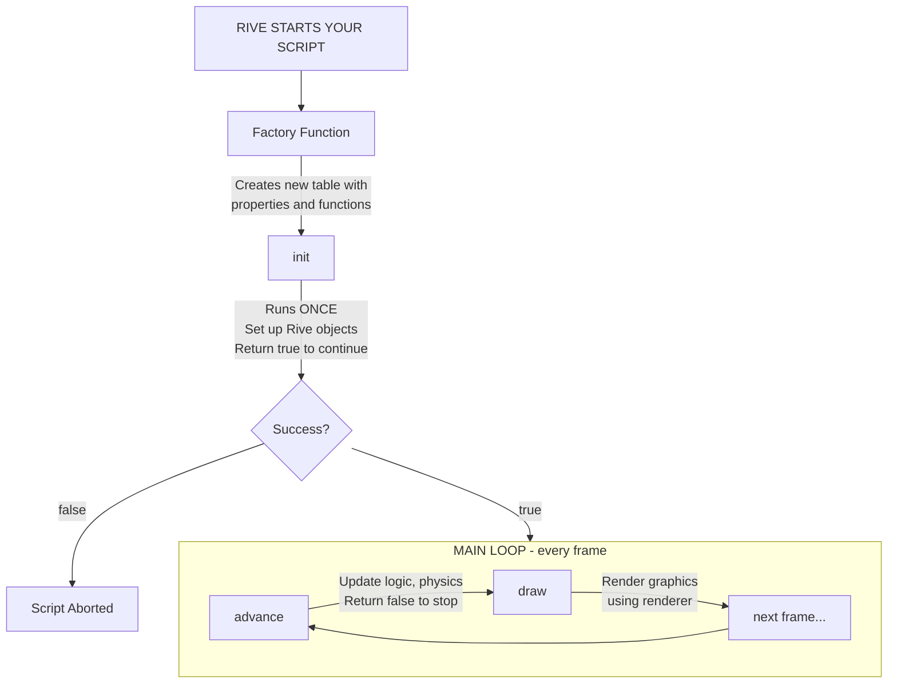

import Quiz from '@site/src/components/Quiz';
import Term from '@site/src/components/Term';

# How Rive Scripts Work

:::tip New to Programming?
This page uses comparisons to JavaScript and After Effects. If you've never programmed before, start with **[Your First Rive Script](/getting-started/your-first-script)** instead - it teaches the same concepts from scratch without assuming prior knowledge.
:::

:::info For Developers
This page explains **why** Rive scripts look the way they do. If you're coming from After Effects expressions or JavaScript, this will make everything click.
:::

---

## Template at a Glance

When you create a script in Rive, you'll see this. Here's what each part does:

| Code | Purpose |
|------|---------|
| `--!strict` | **Enable strict type checking (optional directive; enforced by Rive)** |
| `export type MyNode = { path: Path, time: number, speed: Input<number> }` | **Define your script's data shape** — Rive objects (Path, Paint), state variables, editor inputs (`Input<T>`) |
| `function init(self: MyNode) ... end` | **Runs ONCE at startup** — Create Path, Paint objects, initialize state, return true to continue |
| `function advance(self, seconds) ... end` | **Runs every animation frame (optional)** — Animation, physics, return true to keep running |
| `function draw(self, renderer) ... end` | **Runs when canvas repaints (REQUIRED)** — Draw paths with renderer, should be pure (no state changes) |
| `return function(): Node<MyNode> ... end` | **Factory function (REQUIRED)** — Creates fresh instance per node, wire up lifecycle functions, set `Input<T>` defaults, use `late()` for runtime values |

---

## Quick Start for Experienced Developers

:::tip Already know JavaScript/TypeScript?
Here's the mental model - then you can start coding and reference details as needed.
:::

| Rive/Luau | JavaScript/TypeScript Equivalent |
|-----------|----------------------------------|
| `--!strict` | TypeScript's strict mode |
| `export type MyNode = {}` | `interface MyNode {}` |
| `self` parameter | `this` (but explicit, not a keyword) |
| `function init(self)` | `constructor()` |
| `function draw(self, renderer)` | `render()` method |
| `function advance(self, seconds)` | `requestAnimationFrame` callback |
| `return function(): Node<T>` | Factory pattern / `() => new MyClass()` |
| `late()` | Placeholder for values set in constructor |
| `Input<number>` | React props / component inputs |

**Key differences from JS:**
- `~=` instead of `!==`
- `and`/`or`/`not` instead of `&&`/`||`/`!`
- `local` instead of `let`/`const`
- Tables use `{}` for both arrays and objects
- String concatenation: `..` or backtick interpolation `` `Hello {name}` ``
- No semicolons needed, blocks end with `end`

**You can start coding now.** Reference these sections as needed:

| Topic | Section |
|-------|---------|
| Full lifecycle details | [<Term>Node</Term> Lifecycle Protocol](/rive/protocols/node-lifecycle) |
| All script types | [Script Types Overview](/rive/script-types) |
| <Term>Input</Term> system | [Inputs and Data Binding](/rive/inputs) |
| Drawing API | [Core Types](/advanced/core-types) (<Term>Path</Term>, <Term>Paint</Term>) |
| Transforms | [Drawing API](/advanced/drawing-api) (<Term>Mat2D</Term>, <Term>Renderer</Term>) |
| Luau syntax | [Variables](/fundamentals/variables), [Functions](/fundamentals/functions) |
| Type system | [Type Annotations](/types/annotations) |

---

## The Big Picture: What Is a Rive Script?

A Rive script is a small program that runs **inside** your Rive animation. Unlike a web page's JavaScript that runs once when the page loads, a Rive script runs **continuously** — potentially 60 times per second — to animate your graphics in real-time.

Think of it like this:

| Regular Code | Rive Script |
|-------------|-------------|
| Runs once and stops | Runs every frame (60 times/second) |
| You control when it starts | Rive controls when it runs |
| Variables exist until page closes | Variables must be carefully managed |
| You call functions when ready | Rive calls YOUR functions automatically |

### What is a "Node"?

In Rive, a **Node** is any element in your hierarchy - groups, paths, images, text, shapes, etc. Scripts attach to nodes and control their behavior.

**To attach a script to a node:**
1. Select the node in the Rive Editor
2. Open the Inspector panel
3. Click "Add Script" or drag a script file onto the node
4. Configure inputs in the Inspector

When a script is attached to a node, that script can draw graphics at that node's position and respond to pointer events within that node's bounds.

---

## Why Can't I Just Write Code?

In After Effects expressions or regular JavaScript, you write code and it runs:

```javascript
// After Effects expression - just write it!
value + [100, 0]

// JavaScript - just write it!
console.log("Hello!");
```

But Rive scripts can't work this way because:

1. **Rive needs to call your code at specific times** (when initializing, when drawing, when advancing)
2. **Your code runs repeatedly**, so data must persist between runs
3. **Multiple copies of your script can exist** on different objects

This is why Rive scripts have a specific **structure** or "protocol" — it's how Rive knows what code to run and when.

---

## The Protocol: A Contract With Rive

A "protocol" is like a contract. Rive promises to call certain functions at certain times, and you promise to provide those functions in a specific format.

### The Minimum Valid Script

Here's the smallest script that works:

```lua
--!strict

export type MyScript = {}

function init(self: MyScript): boolean
    return true
end

function draw(self: MyScript, renderer: Renderer)
end

return function(): Node<MyScript>
    return {
        init = init,
        draw = draw,
    }
end
```

**That's 17 lines before you even do anything!** Let's understand WHY each part exists.

---

## Breaking Down Each Part

### 1. `--!strict` — Catching Mistakes Early

```lua
--!strict
```

**What it does:** Turns on "strict mode" — the type checker analyzes your code before it runs.

**Why `--!` syntax?** In Lua, `--` starts a comment. The `!` immediately after makes it a *directive* - a special instruction to the compiler rather than regular code. It's like HTML's `<!DOCTYPE>` - a signal that affects how the file is processed.

**Why it's recommended:** Rive enforces strict typing either way, but including `--!strict` makes the intent explicit and keeps scripts consistent across tools.

**Coming from JavaScript?** This is like TypeScript's strict mode. Without it, you can write `const x = "hello"; x.toFixed(2)` and it fails at runtime. With strict mode, you catch it immediately.

**Coming from After Effects?** AE expressions don't have this — errors only show when the expression runs. Strict mode is like having a spell-checker that also checks your logic.

:::tip Real Benefit
If you mistype a variable name or call a function with wrong arguments, you'll see a red underline immediately — not a runtime crash.
:::

---

### 2. `export type MyScript = {}` — Describing Your Data

```lua
export type MyScript = {
    health: number,   -- Any data your script needs to track
    name: string,     -- Can be any property names you choose
}
```

**What it does:** Defines the "shape" of your script's persistent data - the properties your script will store and use.

**Why these example properties?** `health` and `name` are just examples - you'd replace them with whatever your script actually needs. A particle system might have `particles: {ParticleData}`, a button might have `isPressed: boolean`, etc.

**Why it exists:** Rive creates an object for your script, and this tells Rive what properties that object will have. The type checker uses this to ensure you don't accidentally access properties that don't exist.

**Coming from JavaScript?** This is like TypeScript's interface:
```typescript
// JavaScript/TypeScript equivalent
interface MyScript {
    health: number;
    name: string;
}
```

**Coming from After Effects?** AE expressions don't have typed data structures. You just use variables. The `export type` is how you declare "my script will have these values that persist between frames."

**Why "export"?** The `export` keyword makes the type visible to Rive's type system. Without it, Rive can't verify your script is correctly structured.

---

### 3. `function init(self: MyScript): boolean` — Running Once at Startup

```lua
function init(self: MyScript): boolean
    self.health = 100
    print("Script started!")
    return true
end
```

**What it does:** Runs **once** when your script starts. This is where you set up initial values.

**The strange syntax explained:**

| Part | Meaning |
|------|---------|
| `self: MyScript` | The first parameter is your script's data object, with the type `MyScript` |
| `: boolean` at the end | This function must return `true` or `false` |
| `return true` | Tells Rive "initialization succeeded, keep running" |

**Coming from JavaScript?**
```javascript
// JavaScript mental model
function init(self /*: MyScript */) /*: boolean */ {
    self.health = 100;
    console.log("Script started!");
    return true; // Keep running
}
```

**Coming from After Effects?** This is similar to running code at time=0. But instead of checking `if (time === 0)`, Rive automatically calls `init` once at the start.

**Why return true/false?**
- `return true` = "Everything is fine, keep my script running"
- `return false` = "Something went wrong, disable my script"

---

### 4. `function draw(self: MyScript, renderer: Renderer)` — Rendering on Repaint

```lua
function draw(self: MyScript, renderer: Renderer)
    -- Drawing code goes here
end
```

**What it does:** Called when Rive needs to repaint your graphics. This may happen multiple times per frame or less frequently depending on rendering needs.

**Why it exists:** Rive's rendering system needs to know what to draw. The `renderer` parameter is how you tell Rive to draw shapes, paths, etc.

**Even if empty, it must exist!** Rive needs this function to recognize your script as a Node script. Without it, you can't attach the script to nodes.

**Coming from JavaScript Canvas?**
```javascript
// Similar concept in Canvas
function draw(ctx) {
    ctx.fillRect(0, 0, 100, 100);
}
requestAnimationFrame(draw);
```

---

### 5. `return function(): Node<MyScript>` — The Factory Function

This is the most confusing part for beginners. Let's break it down:

```lua
return function(): Node<MyScript>
    return {
        init = init,
        draw = draw,
    }
end
```

**What it does:** Returns a "factory" — a function that creates new instances of your script.

**Why it exists:** You might attach your script to 10 different objects. Each one needs its own separate data. The factory function creates a fresh copy for each.

**Coming from JavaScript classes?**
```javascript
// JavaScript mental model
class MyScript {
    constructor() {
        this.health = 100;
    }

    init() {
        return true;
    }

    draw(renderer) {
        // ...
    }
}

// The factory is like:
export default () => new MyScript();
```

**Why not just write the code directly?**

If you had:
```lua
-- WRONG: No factory
local data = { health = 100 }  -- Only ONE copy ever!
```

Then every object using this script would share the same `health` variable! When one object takes damage, ALL objects take damage.

The factory pattern ensures each object gets its own fresh data:
```lua
-- RIGHT: Factory creates fresh data for each object
return function()
    return {
        health = late(),  -- Each object gets its own health
        init = init,
        draw = draw,
    }
end
```

---

## What is `self`?

The `self` parameter is your script's **persistent data storage**. It's passed to every function so you can access and modify your data.

```lua
function init(self: MyScript): boolean
    self.score = 0  -- Store initial score
    return true
end

function advance(self: MyScript, elapsed: number): boolean
    self.score += 1  -- Update score
    return true
end

function draw(self: MyScript, renderer: Renderer)
    print(self.score)  -- Read score
end
```

:::tip Coming from JavaScript?
`self` serves the same **purpose** as JavaScript's `this` — accessing instance data. But there's a critical difference:

| | JavaScript `this` | Luau `self` |
|--|-------------------|-------------|
| **Type** | Reserved keyword | Just a parameter name |
| **Provided** | Automatically by the engine | Explicitly as first parameter |
| **Rename it?** | No, it's a keyword | Yes! Could be `me`, `obj`, anything |

```javascript
// JavaScript: 'this' is a reserved keyword, implicit
class MyScript {
    init() { this.score = 0; }
}
```

```lua
-- Luau: 'self' is just a parameter name, explicit
function init(self: MyScript): boolean
    self.score = 0
    return true
end

-- This works too (but don't do it):
function init(potato: MyScript): boolean
    potato.score = 0  -- Same thing!
    return true
end
```

**Bottom line:** `self` is a **convention**, not a keyword. It's just the first parameter that Rive passes your script's data object to.
:::

---

## What is `late()`?

You'll see this mysterious function in scripts:

```lua
return function(): Node<MyScript>
    return {
        init = init,
        draw = draw,
        health = late(),  -- What does this mean?
    }
end
```

**What it does:** `late()` is a type-safe placeholder that says "this value will be set later, in `init()`."

**Why it exists:** The factory function runs BEFORE `init()`. While you CAN create objects like `Path.new()` in the factory, it's better to use `late()` because:
- Objects created in factory are shared across instances
- Creating in `init()` ensures each node gets unique objects
- `late()` satisfies the type checker in `--!strict` mode

So `late()` is like writing "TBD" — it's a type-safe placeholder for values you'll set in `init()`.

**The simple rule:**

| Type | In Factory | Why |
|------|-----------|-----|
| `Input<T>` | Direct value: `speed = 100` | Default shown in Editor |
| Objects for init() | `late()` (recommended) | Type-safe, created per-instance in `init()` |

:::tip
`nil` also works at runtime, but `late()` is preferred for type safety in strict mode.
:::

**Example:**
```lua
export type MyScript = {
    path: Path,              -- Rive object → late()
    paint: Paint,            -- Rive object → late()
    startTime: number,       -- Calculated in init() → late()
    speed: Input<number>,    -- Editor input → direct value
}

return function(): Node<MyScript>
    return {
        init = init,
        draw = draw,
        path = late(),       -- Created with Path.new() in init()
        paint = late(),      -- Created with Paint.new() in init()
        startTime = late(),  -- Set to os.clock() in init()
        speed = 100,         -- Default value shown in Editor's Inspector
    }
end
```

:::tip Memory Aid
**"late() = I'll set it in init()"** — for anything you create or calculate at runtime.
**"Direct value = Input default"** — for `Input<T>` properties that appear in the Editor.
:::

---

## What is `Input<T>`?

Inputs are values that appear in the Rive Editor's inspector panel, allowing designers to tweak values without editing code.

```lua
export type MyScript = {
    speed: Input<number>,
    playerName: Input<string>,
    isEnabled: Input<boolean>,
}
```

**Accessing Input values:**
```lua
function init(self: MyScript): boolean
    -- Inputs are read directly in this course
    print(self.speed)       -- The number, e.g. 100
    print(self.playerName)  -- The string, e.g. "Hero"
    print(self.isEnabled)   -- The boolean, e.g. true
    return true
end
```

**From scripts, inputs appear read-only** — you access them directly (e.g., `self.speed`) but shouldn't reassign them. However, inputs CAN be updated externally through <Term>ViewModel</Term> bindings or <Term>State Machine</Term> connections.

---

## The Complete Picture

Here's how everything fits together - a pulsing circle that demonstrates all the key concepts:

```lua
--!strict  -- ① Optional: make strict typing explicit

-- ② Define what data your script stores
export type PulsingCircle = {
    path: Path,               -- Rive drawing object
    paint: Paint,             -- Rive styling object
    time: number,             -- Accumulated time
    speed: Input<number>,     -- Editor-editable: pulse speed
    size: Input<number>,      -- Editor-editable: base size
}

-- Helper function to build a circle path
local function buildCircle(path: Path, radius: number)
    local k = 0.5522847498  -- Bezier constant for circles
    path:reset()
    path:moveTo(Vector.xy(0, -radius))
    path:cubicTo(Vector.xy(radius * k, -radius), Vector.xy(radius, -radius * k), Vector.xy(radius, 0))
    path:cubicTo(Vector.xy(radius, radius * k), Vector.xy(radius * k, radius), Vector.xy(0, radius))
    path:cubicTo(Vector.xy(-radius * k, radius), Vector.xy(-radius, radius * k), Vector.xy(-radius, 0))
    path:cubicTo(Vector.xy(-radius, -radius * k), Vector.xy(-radius * k, -radius), Vector.xy(0, -radius))
    path:close()
end

-- ③ Initialization (runs once)
function init(self: PulsingCircle): boolean
    self.path = Path.new()
    self.paint = Paint.with({ style = "fill", color = Color.rgb(100, 150, 255) })
    self.time = 0
    print(`Circle initialized with speed={self.speed}, size={self.size}`)
    return true
end

-- ④ Update logic (runs every frame)
function advance(self: PulsingCircle, elapsed: number): boolean
    self.time += elapsed * self.speed

    -- Calculate pulsing radius using sine wave
    local pulse = math.sin(self.time) * 0.3 + 1  -- Oscillates between 0.7 and 1.3
    local radius = self.size * pulse

    -- Rebuild path with new radius
    buildCircle(self.path, radius)
    return true
end

-- ⑤ Drawing (runs on canvas repaint - keep pure!)
function draw(self: PulsingCircle, renderer: Renderer)
    renderer:drawPath(self.path, self.paint)
end

-- ⑥ Factory function (creates instances)
return function(): Node<PulsingCircle>
    return {
        init = init,
        advance = advance,
        draw = draw,
        path = late(),      -- Created in init()
        paint = late(),     -- Created in init()
        time = late(),      -- Set in init()
        speed = 3,          -- Input: default pulse speed
        size = 50,          -- Input: default base size
    }
end
```

**Try it:** Paste this into a Node script in Rive. You'll see a pulsing blue circle. Adjust the `speed` and `size` inputs in the editor to see how they affect the animation.

---

## Lifecycle: When Things Run



---

## AE Expressions vs Luau: Quick Comparison

| Concept | After Effects | Luau/Rive |
|---------|--------------|-----------|
| Run timing | Evaluates for each frame | `advance()` runs each frame, `draw()` on repaint |
| Setup code | `if (time === 0)` check | `init()` function |
| Persistent data | Not available | `self.variableName` |
| Types | None | `export type`, annotations |
| Variables | `var x = 5;` | `local x = 5` |
| Functions | `function f() {}` | `function f() end` |
| Not equal | `!==` | `~=` |
| String join | `"a" + "b"` | `"a" .. "b"` or interpolation |
| Array length | `arr.length` | `#arr` |
| Comments | `// comment` | `-- comment` |
| Blocks | `{ }` | `then`/`do`/`end` |

---

## JavaScript vs Luau: Quick Comparison

| Concept | JavaScript | Luau |
|---------|-----------|------|
| Variable | `let x = 5;` | `local x = 5` |
| Constant | `const x = 5;` | `local x = 5` (no const) |
| Function | `function f() {}` | `function f() end` |
| Arrow | `(x) => x * 2` | `function(x) return x * 2 end` |
| Not equal | `!==` | `~=` |
| And/Or | `&&` / `||` | `and` / `or` |
| Not | `!x` | `not x` |
| String join | `"a" + "b"` | `"a" .. "b"` |
| Template | `` `Hello ${name}` `` | `` `Hello {name}` `` |
| Array | `[1, 2, 3]` | `{1, 2, 3}` |
| Object | `{a: 1}` | `{a = 1}` |
| Array length | `arr.length` | `#arr` |
| For loop | `for (let i = 0; i < 10; i++)` | `for i = 0, 9 do ... end` |
| For-each | `for (const item of arr)` | `for _, item in ipairs(arr) do ... end` |
| If | `if (x) { }` | `if x then ... end` |
| Else | `else { }` | `else ... end` |
| Null | `null` / `undefined` | `nil` |
| This | `this.x` | `self.x` |
| Class | `class X {}` | (no classes, use tables) |
| Falsy | `false, 0, "", null, undefined` | `false, nil` only |

---

## Knowledge Check

<Quiz
  question="Why does a Rive script need a factory function?"
  id="how-q1"
  options={[
    { text: "To make the code run faster" },
    { text: "To create separate data for each object using the script", correct: true },
    { text: "To connect to the Rive server" },
    { text: "Factory functions are optional" },
  ]}
  explanation="The factory function creates a fresh set of data for each object. Without it, all objects would share the same data, causing unintended interactions."
/>

<Quiz
  question="What does 'return true' in init() mean?"
  id="how-q2"
  options={[
    { text: "The script calculated a true value" },
    { text: "Initialization succeeded, keep the script running", correct: true },
    { text: "The script should restart" },
    { text: "Debug mode is enabled" },
  ]}
  explanation="Returning true from init() tells Rive that initialization succeeded and the script should continue running. Returning false would disable the script."
/>

<Quiz
  question="When should you use late() vs a direct value?"
  id="how-q3"
  options={[
    { text: "late() for everything, direct values never" },
    { text: "Direct values for Input<T>, late() for values set in init()", correct: true },
    { text: "late() for numbers, direct values for strings" },
    { text: "They're interchangeable" },
  ]}
  explanation="Input<T> properties need direct default values in the factory. Everything else that gets set in init() (like Path, Paint, computed values) uses late()."
/>

<Quiz
  question="What is 'self' in a Rive script?"
  id="how-q4"
  options={[
    { text: "A reserved keyword like 'this' in JavaScript" },
    { text: "The script's persistent data object passed to each function", correct: true },
    { text: "A global variable" },
    { text: "The Rive editor" },
  ]}
  explanation="Unlike JavaScript's 'this' which is a reserved keyword with special binding rules, 'self' in Luau is just a parameter name convention. It's the first parameter passed to lifecycle functions - your script's data object containing all properties defined in your export type. You could technically name it anything, but 'self' is the standard convention."
/>

---

## Summary: The Essential Pattern

Every Rive script follows this pattern:

1. **Optional: declare strict mode** (`--!strict`)
2. **Define your data type** (`export type`)
3. **Implement lifecycle functions** (`init`, `draw`, optionally `advance`)
4. **Return a factory function** that creates instances

Once you understand WHY each part exists, the structure becomes second nature!

---

## Next Steps

- Continue to [1.1 Variables, Types & Operators](/fundamentals/variables)
- Need a refresher? Review [Quick Reference](/quick-reference)
