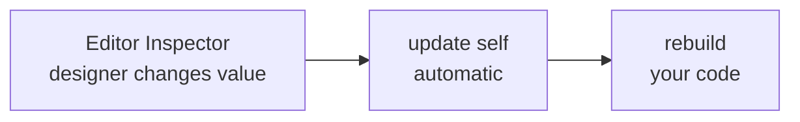
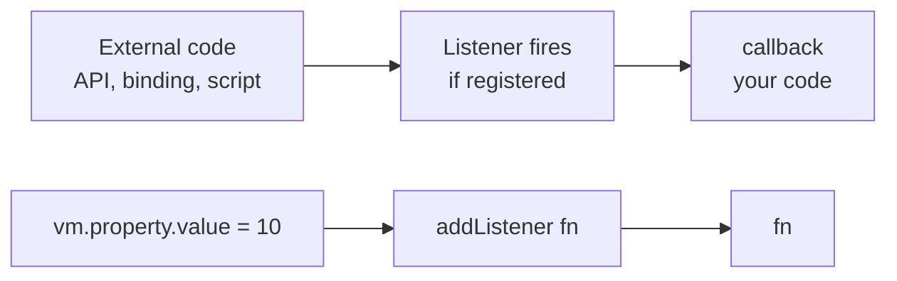

import Quiz from '@site/src/components/Quiz';
import ExerciseValidator from '@site/src/components/ExerciseValidator';
import Term from '@site/src/components/Term';

# Inputs and Data Binding

## Learning Objectives
- Define and use script inputs with `Input<T>`
- Read <Term>Input</Term> values directly (e.g., `self.size`)
- Respond to input changes with `update()`
- Connect to ViewModels for complex data binding

---

## AE/JS Syntax Comparison

| Concept | After Effects / JavaScript | Luau (Rive Scripts) |
|---------|---------------------------|---------------------|
| Editor control | Effect Control (Slider, Checkbox) | `Input<number>`, `Input<boolean>` |
| Read control value | `effect("Slider Control")(1)` | `self.slider` |
| Watch for changes | `posterizeTime()` or manual check | `update(self)` callback |
| Default value | Set in Effect Controls Panel | Set in factory return table |
| Property binding | Link expression to property | `context:viewModel()` |
| Read-only input | N/A (AE controls are always editable) | `Input<T>` (read-only by convention, not runtime-enforced) |
| Two-way binding | Not native (requires workarounds) | <Term>ViewModel</Term> `.value` setter |

:::info Input Access in This Course
In this version of Rive scripting, inputs are read directly (e.g., `self.size`). The editor still treats them as inputs, but you do not access a `.value` field.
:::

---

## Rive Context: Inputs Are Your Editor Controls

Script inputs are how designers control your script from the Rive UI. You define them in the script type and provide defaults in the factory return table.

**Key rules:**
- Inputs are **intended to be read-only** in scripts (read them directly, don't reassign)
- While not runtime-enforced, writing to inputs bypasses the editor binding system
- Use `update(self)` to respond to changes
- Use `late()` or `nil` for inputs that are assigned in the editor (ViewModel or <Term>Artboard</Term> inputs)

---

## Input Definition Pattern

```lua
--!strict

export type MyNode = {
    size: Input<number>,
    tint: Input<Color>,
}

return function(): Node<MyNode>
    return {
        init = init,
        draw = draw,
        size = 80,              -- Default for size input
        tint = Color.rgb(255, 80, 120),  -- Default for color input
    }
end
```

```typescript
// JavaScript/TypeScript mental model:
// Inputs are like React props with default values

interface Props {
    size: number;       // Default: 80
    tint: Color;        // Default: rgb(255, 80, 120)
}

class MyComponent {
    props: Props = {
        size: 80,
        tint: { r: 255, g: 80, b: 120 }
    };
}
```

When you define an `Input<T>` type in your script, Rive automatically creates a control in the inspector panel. The factory return value provides the default.

---

## Supported Input Types

| Type | Example Default | Description | AE Equivalent |
|------|-----------------|-------------|---------------|
| `Input<number>` | `42` | Numeric slider/field | Slider Control |
| `Input<boolean>` | `true` | Checkbox | Checkbox Control |
| `Input<string>` | `"hello"` | Text field | N/A |
| `Input<Color>` | `Color.rgb(255, 0, 0)` | Color picker | Color Control |
| `Input<Data.X>` | `late()` | ViewModel reference | N/A |

---

## Practice Exercises

### Exercise 1: Size + Color Inputs ⭐⭐ {#exercise-1-size-color-inputs}

### Premise

The update() function is called only when inputs change. This is more efficient than rebuilding every frame in advance()—you only do work when the data actually changes.

:::info Goal
By the end of this exercise, you will be able to Complete the rebuild function to build a square <Term>Path</Term> based on the size input. The path should be centered at the origin with corners at (-half, -half) to (half, half).
:::

### Use Case

This pattern shows up whenever you build behavior in Rive scripts.

**Example scenarios:**
- Debugging script behavior
- Driving animation logic

---

### Setup

#### In Rive Editor:

1. **Create the script:**
   - Assets panel → `+` → Script → Node Script
   - Name it `Exercise1_Exercise1SizeColorInputs`

2. **Attach and run:**
   - Attach to any shape and press Play

3. **Open the Console:**
   - View → Console

---

### Starter Code

```lua
--!strict
-- A square that rebuilds when size input changes

export type InputSquare = {
    size: Input<number>,
    path: Path,
    paint: Paint,
}

local function rebuild(self: InputSquare)
    -- TODO 1: Calculate half as size divided by 2
    local half = 0

    -- TODO 2: Reset the path and build a square
    -- Use self.path:reset() first
    -- Then moveTo(-half, -half), lineTo corners, and close()

    print(\`Rebuilt: size={self.size}\`)
    print("ANSWER: rebuilt")
end

function init(self: InputSquare): boolean
    print("Creating input-driven square...")
    self.path = Path.new()
    self.paint = Paint.with({ style = "fill", color = Color.rgb(90, 180, 255) })
    rebuild(self)
    return true
end

function update(self: InputSquare)
    rebuild(self)
end

function draw(self: InputSquare, renderer: Renderer)
    renderer:drawPath(self.path, self.paint)
end

return function(): Node<InputSquare>
    return {
        init = init,
        update = update,
        draw = draw,
        size = 80,
        path = late(),
        paint = late(),
    }
end
```

---

### Assignment

Complete these tasks:

1. Complete the rebuild function to build a square path based on the size input. The path should be centered at the origin with corners at (-half, -half) to (half, half).
2. Run the script and verify the console output
3. Copy the `ANSWER:` line into the validator

---

### Expected Output

```
Console prints the relevant debug lines for this exercise.
ANSWER: <your result>
```

---

### Verify Your Answer

<ExerciseValidator
    exerciseId="rive-inputs-1"
    expectedAnswer="ANSWER: rebuilt"
/>

---

### Checklist

- [ ] `--!strict` is at the top
- [ ] All TODOs are replaced with working code
- [ ] Console output includes the `ANSWER:` line

---

---

### Exercise 2: Time-Based Animation ⭐⭐ {#exercise-2-timebased-animation}

### Premise

Time-based calculations with sine/cosine create smooth oscillations. This pattern is the foundation for procedural animation—moving elements based on mathematical functions rather than keyframes.

:::info Goal
By the end of this exercise, you will be able to Complete the advance function to track time and calculate an oscillating position using sine. The position should swing between -60 and +60.
:::

### Use Case

This pattern shows up whenever you build behavior in Rive scripts.

**Example scenarios:**
- Debugging script behavior
- Driving animation logic

---

### Setup

#### In Rive Editor:

1. **Create the script:**
   - Assets panel → `+` → Script → Node Script
   - Name it `Exercise2_Exercise2TimeBasedAnimation`

2. **Attach and run:**
   - Attach to any shape and press Play

3. **Open the Console:**
   - View → Console

---

### Starter Code

```lua
--!strict
-- Animate a position over time using sine wave

export type AnimationDriver = {
    speed: number,
    amplitude: number,
    time: number,
    position: number,
}

function init(self: AnimationDriver): boolean
    print("Driver initialized")
    self.time = 0
    self.position = 0
    return true
end

function advance(self: AnimationDriver, seconds: number): boolean
    -- TODO 1: Add seconds to self.time

    -- TODO 2: Calculate position using sine wave
    -- Formula: math.sin(self.time * self.speed) * self.amplitude

    -- Log progress (every ~30 frames)
    if math.floor(self.time * 60) % 30 == 0 and self.time > 0.1 then
        print(\`Time: {string.format("%.1f", self.time)}s, Position: {string.format("%.1f", self.position)}\`)
    end

    -- Print answer after 2 seconds
    if self.time >= 2 and self.time < 2.02 then
        print("ANSWER: oscillating")
    end

    return true
end

function draw(self: AnimationDriver, renderer: Renderer)
end

return function(): Node<AnimationDriver>
    return {
        init = init,
        advance = advance,
        draw = draw,
        speed = 3,
        amplitude = 60,
        time = 0,
        position = 0,
    }
end
```

---

### Assignment

Complete these tasks:

1. Complete the advance function to track time and calculate an oscillating position using sine. The position should swing between -60 and +60.
2. Run the script and verify the console output
3. Copy the `ANSWER:` line into the validator

---

### Expected Output

```
Console prints the relevant debug lines for this exercise.
ANSWER: <your result>
```

---

### Verify Your Answer

<ExerciseValidator
    exerciseId="rive-inputs-2"
    expectedAnswer="ANSWER: oscillating"
/>

---

### Checklist

- [ ] `--!strict` is at the top
- [ ] All TODOs are replaced with working code
- [ ] Console output includes the `ANSWER:` line

---

---

### Exercise 3: Input Change Counter ⭐⭐ {#exercise-3-input-change-counter}

### Premise

The update() function is called whenever inputs change. By tracking previous values, you can detect and count changes—useful for analytics, undo systems, or triggering one-time effects.

:::info Goal
By the end of this exercise, you will be able to Complete the update function to track how many times the speed input has changed. Store the previous value and compare it to detect changes.
:::

### Use Case

This pattern shows up whenever you build behavior in Rive scripts.

**Example scenarios:**
- Debugging script behavior
- Driving animation logic

---

### Setup

#### In Rive Editor:

1. **Create the script:**
   - Assets panel → `+` → Script → Node Script
   - Name it `Exercise3_Exercise3InputChangeCounter`

2. **Attach and run:**
   - Attach to any shape and press Play

3. **Open the Console:**
   - View → Console

---

### Starter Code

```lua
--!strict
-- Track how many times an input has changed

export type InputTracker = {
    speed: Input<number>,
    previousSpeed: number,
    changeCount: number,
}

function init(self: InputTracker): boolean
    print("Input tracker ready")
    self.previousSpeed = self.speed
    self.changeCount = 0
    return true
end

function update(self: InputTracker)
    -- TODO 1: Check if speed has changed from previousSpeed

    -- TODO 2: If changed:
    --   - Increment changeCount
    --   - Print the change: "Speed changed: {old} -> {new} (change #{count})"
    --   - Update previousSpeed to current value

    -- TODO 3: If changeCount reaches 3, print "ANSWER: 3"

end

function draw(self: InputTracker, renderer: Renderer)
end

return function(): Node<InputTracker>
    return {
        init = init,
        update = update,
        draw = draw,
        speed = 2,
        previousSpeed = 0,
        changeCount = 0,
    }
end
```

---

### Assignment

Complete these tasks:

1. Complete the update function to track how many times the speed input has changed. Store the previous value and compare it to detect changes.
2. Run the script and verify the console output
3. Copy the `ANSWER:` line into the validator

---

### Expected Output

```
Console prints the relevant debug lines for this exercise.
ANSWER: <your result>
```

---

### Verify Your Answer

<ExerciseValidator
    exerciseId="rive-inputs-3"
    expectedAnswer="ANSWER: 3"
/>

---

### Checklist

- [ ] `--!strict` is at the top
- [ ] All TODOs are replaced with working code
- [ ] Console output includes the `ANSWER:` line

---

---

## When to Use Each Approach

| Approach | Use When | AE/JS Mental Model |
|----------|----------|-------------------|
| Script Inputs (`Input<T>`) | Per-instance configuration (each script instance can have different values) | Component props |
| `context:viewModel()` | Global data shared across all scripts | Redux store / React Context |
| `late()` | Editor-assigned references (ViewModels, other nodes) | Dependency injection |
| `addListener()` | Reactive updates to external changes | Event subscription / Observable |

---

## `Input<T>` vs ViewModel: When to Use Which

This is a common source of confusion. Here's how to think about it:

### The Core Difference

| | `Input<T>` | ViewModel Property |
|--|----------|-------------------|
| **Scope** | Per-instance (each script can have different values) | Global (shared across all scripts) |
| **Set from** | Rive editor inspector panel | Runtime API, external code, or bindings |
| **Direction** | Read-only in scripts | Read/write in scripts |
| **Changes trigger** | `update(self)` callback | Listeners you register |

### Mental Model: Props vs State

Think of it like React:

```lua
-- Input<T> = Props (passed to component, read-only)
export type Button = {
    label: Input<string>,    -- Configured per-instance in editor
    width: Input<number>,    -- Each button can have different width
}

-- ViewModel = Global State (like Redux/Context)
-- Multiple scripts can read/write the same score
function init(self: GameUI, context: Context): boolean
    local vm = context:viewModel()
    local score = vm:getNumber("score")  -- Shared across all scripts
    score.value = score.value + 100       -- Can write to it!
    return true
end
```

### Update Flow Comparison

**Input&lt;T&gt; Update Flow:**



**ViewModel Property Update Flow:**



### Choosing the Right One

**Use `Input<T>` when:**
- Designer needs to tweak values per-instance in the editor
- Value is static configuration (size, color, speed)
- Different instances need different values
- No runtime changes needed

**Use ViewModel when:**
- Value changes at runtime (score, health, progress)
- Multiple scripts need to share data
- External code needs to update values
- Two-way binding with UI elements

### Example: Health Bar

```lua
export type HealthBar = {
    -- Input: Configuration that designers set per-instance
    barWidth: Input<number>,     -- Each health bar can be different size
    barHeight: Input<number>,

    -- ViewModel: Runtime data shared globally
    context: Context,
}

function init(self: HealthBar, context: Context): boolean
    self.context = context

    -- Get shared player health from ViewModel
    local vm = context:viewModel()
    local health = vm:getNumber("playerHealth")

    -- Listen for changes (not automatic like update())
    if health then
        health:addListener(function()
            rebuild(self)  -- Redraw when health changes
            self.context:markNeedsUpdate()
        end)
    end

    return true
end

function update(self: HealthBar)
    -- Called when barWidth or barHeight changes
    rebuild(self)
end
```

---

### Exercise 4: Progress Bar with Inputs ⭐⭐ {#exercise-4-progress-bar-with-inputs}

### Premise

Progress bars combine multiple inputs (width, height, current, max) to create a visual representation of data. This pattern is used for health bars, loading indicators, and any value-to-visual mapping.

:::info Goal
By the end of this exercise, you will be able to Complete the rebuild function to draw a progress bar. Calculate the filled width based on current/max ratio, and build paths for both background and foreground.
:::

### Use Case

This pattern shows up whenever you build behavior in Rive scripts.

**Example scenarios:**
- Debugging script behavior
- Driving animation logic

---

### Setup

#### In Rive Editor:

1. **Create the script:**
   - Assets panel → `+` → Script → Node Script
   - Name it `Exercise4_Exercise4ProgressBarWithInputs`

2. **Attach and run:**
   - Attach to any shape and press Play

3. **Open the Console:**
   - View → Console

---

### Starter Code

```lua
--!strict
-- A progress bar driven by inputs

export type ProgressBar = {
    barWidth: Input<number>,
    barHeight: Input<number>,
    current: Input<number>,
    max: Input<number>,
    bgPath: Path,
    fillPath: Path,
    bgPaint: Paint,
    fillPaint: Paint,
}

local function rebuild(self: ProgressBar)
    -- TODO 1: Calculate the percentage (current / max)
    local percent = 0

    -- TODO 2: Calculate filledWidth (percent * barWidth)
    local filledWidth = 0

    -- TODO 3: Build bgPath as full-width rectangle (0,0 to barWidth,barHeight)
    self.bgPath:reset()
    -- Add moveTo, lineTo, lineTo, lineTo, close

    -- TODO 4: Build fillPath as partial-width rectangle (0,0 to filledWidth,barHeight)
    self.fillPath:reset()
    -- Add moveTo, lineTo, lineTo, lineTo, close

    -- Print status
    print(\`Current: {self.current} / Max: {self.max}\`)
    print(\`Fill percentage: {math.floor(percent * 100)}%\`)
    print(\`ANSWER: {math.floor(percent * 100)}%\`)
end

function init(self: ProgressBar): boolean
    print("Progress bar initialized")
    self.bgPath = Path.new()
    self.fillPath = Path.new()
    self.bgPaint = Paint.with({ style = "fill", color = Color.rgb(60, 60, 60) })
    self.fillPaint = Paint.with({ style = "fill", color = Color.rgb(80, 200, 120) })
    rebuild(self)
    return true
end

function update(self: ProgressBar)
    rebuild(self)
end

function draw(self: ProgressBar, renderer: Renderer)
    renderer:drawPath(self.bgPath, self.bgPaint)
    renderer:drawPath(self.fillPath, self.fillPaint)
end

return function(): Node<ProgressBar>
    return {
        init = init,
        update = update,
        draw = draw,
        barWidth = 200,
        barHeight = 20,
        current = 75,
        max = 100,
        bgPath = late(),
        fillPath = late(),
        bgPaint = late(),
        fillPaint = late(),
    }
end
```

---

### Assignment

Complete these tasks:

1. Complete the rebuild function to draw a progress bar. Calculate the filled width based on current/max ratio, and build paths for both background and foreground.
2. Run the script and verify the console output
3. Copy the `ANSWER:` line into the validator

---

### Expected Output

```
Console prints the relevant debug lines for this exercise.
ANSWER: <your result>
```

---

### Verify Your Answer

<ExerciseValidator
    exerciseId="rive-inputs-4"
    expectedAnswer="ANSWER: 75%"
/>

---

### Checklist

- [ ] `--!strict` is at the top
- [ ] All TODOs are replaced with working code
- [ ] Console output includes the `ANSWER:` line

---

---

## Knowledge Check

<Quiz
  question="How do you read the value of an Input in a Node script?"
  id="inputs-q1"
  options={[
    { text: "self.size", correct: true },
    { text: "self.size.value" },
    { text: "self.size()" },
    { text: "self.size:get()" },
  ]}
  explanation="Inputs are read directly in this version of Rive scripting (e.g., self.size)."
/>

<Quiz
  question="When is the update() function called?"
  id="inputs-q2"
  options={[
    { text: "Every frame" },
    { text: "When any input changes", correct: true },
    { text: "Only on initialization" },
    { text: "When the script is attached to a node" },
  ]}
  explanation="update() is called whenever any of the script's inputs change, making it the ideal place to rebuild geometry or recalculate dependent values."
/>

<Quiz
  question="What does late() indicate for an input?"
  id="inputs-q3"
  options={[
    { text: "The input is optional" },
    { text: "The input will be assigned in the editor", correct: true },
    { text: "The input updates slowly" },
    { text: "The input is deprecated" },
  ]}
  explanation="late() tells the type system that this input doesn't have a value at construction time but will be assigned in the Rive editor before init runs."
/>

<Quiz
  question="How do you listen for changes to a ViewModel property?"
  id="inputs-q4"
  options={[
    { text: "property.onChange(callback)" },
    { text: "property:addListener(callback)", correct: true },
    { text: "property:watch(callback)" },
    { text: "property.subscribe(callback)" },
  ]}
  explanation="Use addListener() to register a callback that fires whenever the property value changes."
/>

---

## Common Mistakes

### 1. Using `.value` on Inputs

```lua
-- WRONG: .value does not exist on inputs here
local half = self.size.value / 2

-- CORRECT: Read the input directly
local half = self.size / 2
```

### 2. ViewModel Inputs: late() vs nil

```lua
-- Both work at runtime:
return function(): Node<MyNode>
    return {
        character = nil,    -- Works!
        -- OR
        character = late(), -- Also works (recommended for type safety)
    }
end
```

**Note:** `late()` is recommended for type safety in `--!strict` mode, but `nil` works identically at runtime.

### 3. Reassigning Input Values in Scripts

```lua
-- NOT RECOMMENDED: Inputs are intended to be read-only
function advance(self: MyNode, seconds: number): boolean
    self.size = 100  -- Works but bypasses editor binding
    return true
end

-- CORRECT: Read Input values, write to regular properties or ViewModel
function advance(self: MyNode, seconds: number): boolean
    local currentSize = self.size  -- Read
    self.computedSize = currentSize * 2   -- Write to regular property
    return true
end
```

**Note:** While reassigning Input values doesn't cause a runtime error, it bypasses the editor's data binding system. Always use ViewModel properties for two-way binding.

### 4. Rebuilding in advance() Instead of update()

```lua
-- WRONG: Rebuilding every frame even when inputs haven't changed
function advance(self: MyNode, seconds: number): boolean
    rebuild(self)  -- Wasteful!
    return true
end

-- CORRECT: Rebuild only when inputs change
function update(self: MyNode)
    rebuild(self)  -- Called only when inputs change
end
```

---

## Rive Takeaway

Use **inputs** for per-instance tuning (each script instance can have different values) and use **`context:viewModel()`** for global data shared across all scripts in the artboard.

---

## Next Steps

- Continue to [Node Protocol](/rive/protocols/node-protocol)
- Need a refresher? Review [Quick Reference](/quick-reference)
