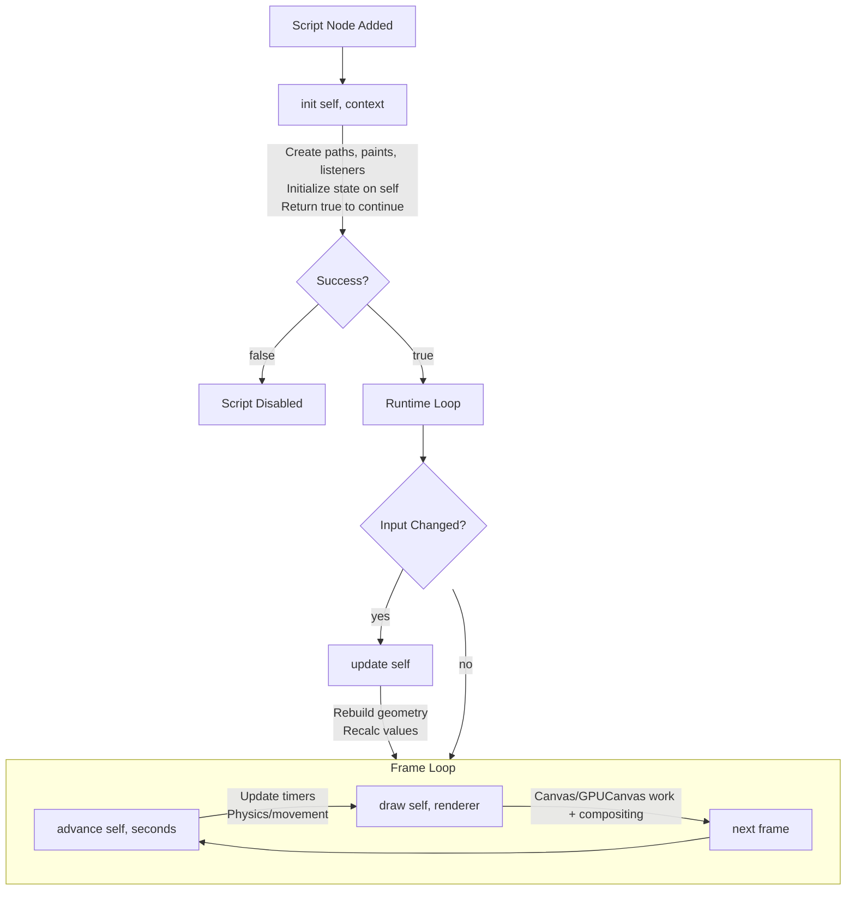

import Quiz from '@site/src/components/Quiz';
import ExerciseValidator from '@site/src/components/ExerciseValidator';
import Term from '@site/src/components/Term';

# Protocols Overview

## Learning Objectives
- Understand when each lifecycle callback runs
- Know where to put different types of logic
- Optimize performance by using the right callback
- Handle pointer events for user interaction

---

## AE/JS Syntax Comparison

| Concept | After Effects / JavaScript | Luau (Rive Scripts) |
|---------|---------------------------|---------------------|
| Initialization | Class `constructor()` | `init(self)` |
| Property change handler | React's `componentDidUpdate` | `update(self)` |
| Frame loop | `requestAnimationFrame(callback)` | `advance(self, seconds)` |
| Render function | Canvas `draw()` or React's `render()` | `draw(self, renderer)` |
| Delta time | `performance.now()` difference | `seconds` parameter in `advance` |
| Click handler | `element.onclick = fn` | `pointerDown(self, event)` |
| This reference | `this` keyword | `self` parameter |

:::danger Critical Difference: Frame Loop Architecture
**After Effects**: Expressions are evaluated when the playhead moves. You don't control the frame loop—AE handles it and just asks "what value at this time?"

**JavaScript (Canvas/WebGL)**: You call `requestAnimationFrame()` and manage your own frame loop. The browser tells you "it's time to draw" and you do everything.

**Rive Scripts**: Rive manages the frame loop automatically. You implement callbacks (`init`, `update`, `advance`, `draw`) and Rive calls them at the right time. You DON'T call `requestAnimationFrame`—Rive does that for you.

```lua
-- Rive handles the loop, you just implement callbacks:
function advance(self: MyNode, seconds: number): boolean
    -- Called every frame automatically
    self.time += seconds
    return true
end
```

```javascript
// JavaScript - you manage the loop yourself:
function loop(timestamp) {
    const deltaTime = timestamp - lastTime;
    lastTime = timestamp;
    advance(deltaTime / 1000);
    draw();
    requestAnimationFrame(loop);  // You call this!
}
requestAnimationFrame(loop);
```
:::

---

## Rive Context: When Your Code Runs

Rive calls your script functions in a specific order. Understanding this lets you put logic in the right place and avoid unnecessary work every frame.

**Lifecycle order:**
1. `init(self, context)` - runs once at startup
2. `update(self)` - runs when any <Term>Input</Term> changes (NO context param!)
3. `advance(self, seconds)` - runs every playback frame (logic); at design time it only fires as zero-delta settle passes
4. `draw(self, renderer)` - records offscreen `Canvas` / `GPUCanvas` work and runs normal renderer compositing

Pointer event handlers (`pointerDown`, `pointerMove`, etc.) run when the user interacts with the script node.

### Lifecycle corrections in the current source snapshot

- A parked Node (`advance` returned `false`) can wake when pointer, keyboard,
  text, or gamepad input arrives. `false` still parks ordinary per-frame work.
- Collapsed `ScriptedDrawable` nodes do not advance; do not use hidden nodes as
  background workers. Editor reinitialization may still perform a zero-step
  settle/update to record paused GPU content once.
- Detached ViewModel instances owned by a script advance at frame end, so
  triggers and listeners can reset. Bound instances are not double-advanced.
- `async(...)` coroutines retain their scripting context across `await`; keep
  ordinary disposed-object and lifetime checks, but do not warn that all
  context-dependent calls are invalid after an await.

---

## What Goes Where

| Callback | Purpose | Frequency | AE/JS Equivalent |
|----------|---------|-----------|------------------|
| **init** | Create paths, paints, listeners, long-lived objects | Once | `constructor()` |
| **update** | Respond to input changes; rebuild paths or cached values | On input change | `componentDidUpdate()` |
| **advance** | Update time-based state (movement, physics, timers) | Every playback frame (design mode: settle passes only) | `requestAnimationFrame` logic |
| **draw** | Record offscreen targets, finish passes, issue <Term>Renderer</Term> commands, and composite images | On canvas repaint | Rive renderer / Early Access GPU |

:::tip Performance Rule
Put expensive work in `update` or `init`, not in `draw` or `advance`. Rebuilding geometry in `advance` (called every frame) wastes resources if inputs haven't changed.
:::

:::info Shader and offscreen canvas rule
Call `Canvas:beginFrame(...)` and `GPUCanvas:beginRenderPass(...)` from
`draw(self, renderer)`, pair them with `endFrame()`/`finish()`, then composite
the resulting image in the same callback. `drawCanvas` is a retired callback;
serialized method bit 15 is reserved for old files only.
:::

---

## Playback vs Design Mode: The Two advance() Clocks

`advance` runs against two very different schedulers depending on whether the artboard is playing. All of the following was validated live in the Rive Early Access editor (2026-06-11) with instrumented probe scripts:

| | Playback (Play / runtime) | Design mode (editing) |
|---|---|---|
| `advance` cadence | Every frame (~60/s) | Event-driven settle passes only (object moves, pointer over canvas, adds, recompiles) |
| `seconds` (delta) | Real elapsed time | **Always `0`** — no clock exists; accumulated time never grows |
| `return false` | Unsubscribes this instance from the advance loop | **Ignored** — editor events keep re-advancing the node |
| `draw` | Every frame, independent of advance | Every repaint, independent (camera pan/zoom repaints without advancing) |

The probe evidence: a node whose `advance` returned `false` received **zero** advance calls during ~10 seconds of playback while drawing ~600 frames alongside an always-`true` node ticking at exactly 60/s. The same false-returning node was re-advanced 200+ times by design-mode editor events with `seconds = 0` on every call.

**Practical rules:**

- Never divide by `seconds` or assume it is non-zero — design-mode settle passes always pass `0`. Guard time-based math: `if seconds > 0 then ... end`.
- Returning `false` from `advance` is a real playback optimization for nodes that have finished animating — but it does not stop `draw`, and it does not reduce design-time work.
- A node that returns `false` still needs its `draw` to render current state on every repaint.
- `draw` can fire before the first `advance` — never rely on advance having run.

---

## The Context Object

The `context` parameter passed to lifecycle functions provides access to the runtime environment. Store it in `init` to use later.

### Context API

| Method | Returns | Description |
|--------|---------|-------------|
| `context:viewModel()` | `ViewModel?` | Gets the current node data-context ViewModel (if bound) |
| `context:rootViewModel()` | `ViewModel?` | Gets the root ViewModel in the data-context hierarchy |
| `context:dataContext()` | `DataContext?` | Gets the current data-context wrapper for ViewModel traversal |
| `context:markNeedsUpdate()` | *void* | Requests a redraw on the next frame |

:::info Context is not the scene host node
`Context` gives a script access to data context, assets, and redraw requests. It does not expose an implicit "parent shape" or host `NodeData` object. Nesting a Node script under a shape or group affects transform, opacity, and draw order through the normal hierarchy, but it does not change which lifecycle parameters the script receives.
:::

### Common Usage

```lua
export type MyNode = {
    context: Context,  -- Store context for later use
}

function init(self: MyNode, context: Context): boolean
    self.context = context  -- Save for use in listeners

    -- Access ViewModel through context
    local vm = context:viewModel()
    if vm then
        local prop = vm:getNumber("score")
        if prop then
            prop:addListener(function()
                -- Request redraw when data changes
                self.context:markNeedsUpdate()
            end)
        end
    end

    return true
end
```

:::info When to Use context:markNeedsUpdate()
Call `markNeedsUpdate()` when external changes (like ViewModel property updates) need to trigger a redraw. This is more efficient than constantly redrawing - it tells Rive "something changed, please redraw next frame."
:::

---

## Lifecycle Flow Diagram



---

## Practice Exercises

### Exercise 1: Lifecycle Probe ⭐ {#exercise-1-lifecycle-probe}

### Premise

Understanding when each callback runs is crucial: init once at start, update when inputs change, advance every frame. This helps you put code in the right place.

:::info Goal
By the end of this exercise, you will be able to Complete the lifecycle probe that logs when each callback runs and counts advance calls for 2 seconds.
:::

### Use Case

This pattern shows up whenever you build behavior in Rive scripts.

**Example scenarios:**
- Debugging script behavior
- Driving animation logic

---

### Setup

#### In Rive Editor:

1. **Create the script:**
   - Assets panel → `+` → Script → Node Script
   - Name it `Exercise1_Exercise1LifecycleProbe`

2. **Add and run:**
   - Add the script to the artboard, position or nest the script node, then press Play

3. **Open the Console:**
   - View → Console

---

### Starter Code

```lua
-- A probe to see when each lifecycle callback runs

export type LifecycleProbe = {
    elapsed: number,
    advanceCount: number,
}

function init(self: LifecycleProbe): boolean
    -- TODO 1: Print "init: Starting probe"

    self.elapsed = 0
    self.advanceCount = 0
    return true
end

function advance(self: LifecycleProbe, seconds: number): boolean
    self.elapsed += seconds

    -- TODO 2: Increment advanceCount

    -- TODO 3: Every second (when floor(elapsed) changes), print "advance tick {count}"

    -- TODO 4: When elapsed >= 2, print "ANSWER: probe" (only once)

    return true
end

function draw(self: LifecycleProbe, renderer: Renderer)
end

return function(): Node<LifecycleProbe>
    return {
        init = init,
        advance = advance,
        draw = draw,
        elapsed = 0,
        advanceCount = 0,
    }
end
```

---

### Assignment

Complete these tasks:

1. Complete the lifecycle probe that logs when each callback runs and counts advance calls for 2 seconds.
2. Run the script and verify the console output
3. Copy the `ANSWER:` line into the validator

---

### Expected Output

```
Console prints the relevant debug lines for this exercise.
ANSWER: probe
```

---

### Verify Your Answer

<ExerciseValidator
    exerciseId="rive-lifecycle-1"
    expectedAnswer="ANSWER: probe"
/>

---

### Checklist

- [ ] All TODOs are replaced with working code
- [ ] Console output includes the `ANSWER:` line

---

---

### Exercise 2: Rebuild Only on Updates ⭐⭐ {#exercise-2-rebuild-only-on-updates}

### Premise

Put expensive work in update, not draw. The update callback only runs when inputs change, saving CPU cycles compared to rebuilding every frame.

:::info Goal
By the end of this exercise, you will be able to Complete the rebuild function and verify it only runs when needed (in init and update, NOT every frame in draw).
:::

### Use Case

This pattern shows up whenever you build behavior in Rive scripts.

**Example scenarios:**
- Debugging script behavior
- Driving animation logic

---

### Setup

#### In Rive Editor:

1. **Create the script:**
   - Assets panel → `+` → Script → Node Script
   - Name it `Exercise2_Exercise2RebuildOnlyOnUpdates`

2. **Add and run:**
   - Add the script to the artboard, position or nest the script node, then press Play

3. **Open the Console:**
   - View → Console

---

### Starter Code

```lua
-- Rebuild geometry only when inputs change

export type OnDemandShape = {
    width: Input<number>,
    height: Input<number>,
    rebuildCount: number,
    path: Path,
    paint: Paint,
}

local function rebuild(self: OnDemandShape)
    -- TODO 1: Increment rebuildCount

    -- TODO 2: Calculate halfW and halfH from width/height

    -- TODO 3: Build rectangle path using reset, moveTo, lineTo, close

    -- Print rebuild info
    print(`Rebuild #{self.rebuildCount}: {self.width} x {self.height}`)

    -- TODO 4: When rebuildCount reaches 2, print "ANSWER: efficient"
end

function init(self: OnDemandShape): boolean
    print("init: Creating shape")
    self.rebuildCount = 0
    self.path = Path.new()
    self.paint = Paint.with({ style = "fill", color = Color.rgb(120, 220, 140) })
    rebuild(self)
    return true
end

function update(self: OnDemandShape)
    rebuild(self)
end

function draw(self: OnDemandShape, renderer: Renderer)
    -- Note: NO rebuild here - that would waste resources!
    renderer:drawPath(self.path, self.paint)
end

return function(): Node<OnDemandShape>
    return {
        init = init,
        update = update,
        draw = draw,
        width = 120,
        height = 80,
        rebuildCount = 0,
        path = late(),
        paint = late(),
    }
end
```

---

### Assignment

Complete these tasks:

1. Complete the rebuild function and verify it only runs when needed (in init and update, NOT every frame in draw).
2. Run the script and verify the console output
3. Copy the `ANSWER:` line into the validator

---

### Expected Output

```
Console prints the relevant debug lines for this exercise.
ANSWER: efficient
```

---

### Verify Your Answer

<ExerciseValidator
    exerciseId="rive-lifecycle-2"
    expectedAnswer="ANSWER: efficient"
/>

---

### Checklist

- [ ] All TODOs are replaced with working code
- [ ] Console output includes the `ANSWER:` line

---

---

### Exercise 3: Combining Lifecycle Callbacks ⭐⭐ {#exercise-3-combining-lifecycle-callbacks}

### Premise

Combining update (for input changes) and advance (for animation) lets you build components that are both configurable AND animated. This is the foundation for interactive game elements.

:::info Goal
By the end of this exercise, you will be able to Complete the advance function to create a pulsing animation. After 2 seconds of animation, print the answer.
:::

### Use Case

This pattern shows up whenever you build behavior in Rive scripts.

**Example scenarios:**
- Debugging script behavior
- Driving animation logic

---

### Setup

#### In Rive Editor:

1. **Create the script:**
   - Assets panel → `+` → Script → Node Script
   - Name it `Exercise3_Exercise3CombiningLifecycleCallbacks`

2. **Add and run:**
   - Add the script to the artboard, position or nest the script node, then press Play

3. **Open the Console:**
   - View → Console

---

### Starter Code

```lua
-- A shape that pulses over time

export type AnimatedShape = {
    baseSize: number,
    pulseSpeed: number,
    time: number,
    path: Path,
    paint: Paint,
}

local function rebuildPath(self: AnimatedShape, size: number)
    local half = size / 2
    self.path:reset()
    self.path:moveTo(Vector.xy(-half, -half))
    self.path:lineTo(Vector.xy(half, -half))
    self.path:lineTo(Vector.xy(half, half))
    self.path:lineTo(Vector.xy(-half, half))
    self.path:close()
end

function init(self: AnimatedShape): boolean
    print("init: Creating animated shape")
    self.time = 0
    self.path = Path.new()
    self.paint = Paint.with({ style = "fill", color = Color.rgb(255, 120, 80) })
    rebuildPath(self, self.baseSize)
    return true
end

function advance(self: AnimatedShape, seconds: number): boolean
    -- TODO 1: Add seconds to self.time

    -- TODO 2: Calculate pulse using: math.sin(self.time * self.pulseSpeed) * 0.2 + 1
    -- This creates a value between 0.8 and 1.2
    local pulse = 1

    -- TODO 3: Calculate currentSize as baseSize * pulse
    local currentSize = self.baseSize

    -- TODO 4: Rebuild the path with currentSize

    -- Log pulse every second
    if math.floor(self.time) > math.floor(self.time - seconds) and self.time > 0 then
        print(`advance: pulse = {string.format("%.2f", pulse)}`)
    end

    -- TODO 5: After 2 seconds, print "ANSWER: pulsing"

    return true
end

function draw(self: AnimatedShape, renderer: Renderer)
    renderer:drawPath(self.path, self.paint)
end

return function(): Node<AnimatedShape>
    return {
        init = init,
        advance = advance,
        draw = draw,
        baseSize = 60,
        pulseSpeed = 2,
        time = 0,
        path = late(),
        paint = late(),
    }
end
```

---

### Assignment

Complete these tasks:

1. Complete the advance function to create a pulsing animation. After 2 seconds of animation, print the answer.
2. Run the script and verify the console output
3. Copy the `ANSWER:` line into the validator

---

### Expected Output

```
Console prints the relevant debug lines for this exercise.
ANSWER: pulsing
```

---

### Verify Your Answer

<ExerciseValidator
    exerciseId="rive-lifecycle-3"
    expectedAnswer="ANSWER: pulsing"
/>

---

### Checklist

- [ ] All TODOs are replaced with working code
- [ ] Console output includes the `ANSWER:` line

---

---

## Pointer Events

Node scripts can also respond to pointer interactions. These are like DOM event handlers in JavaScript.

```lua
function pointerDown(self: MyNode, event: PointerEvent)
    local pos = event.position
    print(`Clicked at {pos.x}, {pos.y}`)
end

function pointerMove(self: MyNode, event: PointerEvent)
    -- Handle mouse/touch movement
end

function pointerUp(self: MyNode, event: PointerEvent)
    -- Handle mouse/touch release
end
```

```javascript
// JavaScript equivalent - DOM event handlers:
element.addEventListener('mousedown', (e) => {
    console.log(`Clicked at ${e.clientX}, ${e.clientY}`);
    e.stopPropagation();  // Similar to event:hit()
});

element.addEventListener('mousemove', (e) => {
    // Not calling stopPropagation = event may continue propagating
});
```

Use `event:hit()` to mark a pointer event handled. Use `event:hit(true)` for translucent hit behavior when you still want lower nodes to receive events through transparent areas.

Include these in your factory return table to enable them:

```lua
return function(): Node<MyNode>
    return {
        init = init,
        draw = draw,
        pointerDown = pointerDown,
        pointerMove = pointerMove,
        pointerUp = pointerUp,
    }
end
```

## Keyboard and Text Events (Source/Runtime Compatibility)

Pinned runtime source includes Node callbacks named `keyboardEvent` and
`textEvent`, using the historical Lua wrapper names `KeyboardInvocation` and
`TextInputInvocation`:

```lua
function keyboardEvent(self: MyNode, event: KeyboardInvocation): boolean
    if event.phase == "down" and event.key == 13 then
        self.submitPressed = true
        return true -- Stop propagation
    end
    return false
end

function textEvent(self: MyNode, event: TextInputInvocation): boolean
    if #event.text > 0 then
        self.lastText = event.text
        return true -- Stop propagation
    end
    return false
end
```

If these callbacks return `true`, the pinned runtime source stops propagation.
They are not listed in the August 14 current Editor `Node<T>` reference and were
not executed in the current MCP probe, so treat them as source/runtime
compatibility rather than current Editor-reference parity. Inside
`ListenerContext`, use the current Editor names `KeyboardEvent` and `TextInput`.

## Gamepad Events (Current Editor Reference)

The current Editor `Node<T>` reference exposes three distinct callbacks:

```lua
function gamepadConnected(self: MyNode, event: GamepadConnected)
    print("connected", event.deviceId, event.mapping)
end

function gamepadEvent(self: MyNode, event: GamepadEvent)
    print(event.changeKind, event.changeIndex, event.changeValue)
end

function gamepadDisconnected(self: MyNode, event: GamepadDisconnected)
    print("disconnected", event.deviceId)
end
```

These signatures passed the August 14 Editor analyzer probe. Hardware gamepad
dispatch was not executed. ListenerAction scripts use the matching
`isGamepadConnected` / `isGamepadEvent` / `isGamepadDisconnected` guards and
`as...` accessors documented in [Events](/api/events#gamepad-events).

:::info Web 2.42.0 focus behavior baseline
The accepted `runtime-v0.1.344` target fixes gamepad device indexing, keeps the
FocusManager on the root artboard, re-homes focus for nested instances, updates
focus with visibility changes, and clears destroyed focus-tree state. These
changes require no new callback. Validate controller focus, nested-artboard
visibility, node destruction, and focus restoration with the production
`.riv`.
:::

---

### Exercise 4: Click Counter ⭐⭐ {#exercise-4-click-counter}

### Premise

Pointer events (pointerDown, pointerMove, pointerUp) enable interactivity. Call `event:hit()` to consume an event. Use `event:hit(true)` for translucent hit behavior.

:::info Goal
By the end of this exercise, you will be able to Complete the click counter that tracks clicks and animates a pop effect. Print the answer after 3 clicks.
:::

### Use Case

This pattern shows up whenever you build behavior in Rive scripts.

**Example scenarios:**
- Debugging script behavior
- Driving animation logic

---

### Setup

#### In Rive Editor:

1. **Create the script:**
   - Assets panel → `+` → Script → Node Script
   - Name it `Exercise4_Exercise4ClickCounter`

2. **Add and run:**
   - Add the script to the artboard, position or nest the script node, then press Play

3. **Open the Console:**
   - View → Console

---

### Starter Code

```lua
-- A clickable shape that counts clicks

export type ClickCounter = {
    clickCount: number,
    displayScale: number,
    path: Path,
    paint: Paint,
}

function init(self: ClickCounter): boolean
    self.clickCount = 0
    self.displayScale = 1

    self.path = Path.new()
    self.path:moveTo(Vector.xy(-60, -30))
    self.path:lineTo(Vector.xy(60, -30))
    self.path:lineTo(Vector.xy(60, 30))
    self.path:lineTo(Vector.xy(-60, 30))
    self.path:close()

    self.paint = Paint.with({ style = "fill", color = Color.rgb(80, 160, 255) })
    return true
end

function pointerDown(self: ClickCounter, event: PointerEvent)
    -- TODO 1: Increment clickCount

    -- TODO 2: Set displayScale to 1.2 for pop effect

    -- TODO 3: Print "Click #{clickCount}"

    -- TODO 4: When clickCount reaches 3, print "ANSWER: interactive"

    -- TODO 5: Call event:hit() to consume this pointer event

end

function advance(self: ClickCounter, seconds: number): boolean
    -- TODO 6: Animate displayScale back to 1
    -- Use: self.displayScale = math.max(1, self.displayScale - seconds * 2)

    return true
end

function draw(self: ClickCounter, renderer: Renderer)
    renderer:save()
    renderer:transform(Mat2D.withScale(self.displayScale, self.displayScale))
    renderer:drawPath(self.path, self.paint)
    renderer:restore()
end

return function(): Node<ClickCounter>
    return {
        init = init,
        pointerDown = pointerDown,
        advance = advance,
        draw = draw,
        clickCount = 0,
        displayScale = 1,
        path = late(),
        paint = late(),
    }
end
```

---

### Assignment

Complete these tasks:

1. Complete the click counter that tracks clicks and animates a pop effect. Print the answer after 3 clicks.
2. Run the script and verify the console output
3. Copy the `ANSWER:` line into the validator

---

### Expected Output

```
Console prints the relevant debug lines for this exercise.
ANSWER: interactive
```

---

### Verify Your Answer

<ExerciseValidator
    exerciseId="rive-lifecycle-4"
    expectedAnswer="ANSWER: interactive"
/>

---

### Checklist

- [ ] All TODOs are replaced with working code
- [ ] Console output includes the `ANSWER:` line

---

---

## Knowledge Check

<Quiz
  question="In what order do the main lifecycle callbacks run?"
  id="lifecycle-q1"
  options={[
    { text: "draw, init, advance, update" },
    { text: "init, update, advance, draw", correct: true },
    { text: "init, advance, update, draw" },
    { text: "update, init, draw, advance" },
  ]}
  explanation="The lifecycle runs: init (once), then update (on input change), advance (every animation frame), and draw (on canvas repaint)."
/>

<Quiz
  question="When should you rebuild geometry in a Node script?"
  id="lifecycle-q2"
  options={[
    { text: "In draw, on every repaint" },
    { text: "In advance, every frame" },
    { text: "In update, when inputs change", correct: true },
    { text: "Never, geometry is immutable" },
  ]}
  explanation="Rebuild geometry in update when inputs change to avoid unnecessary work every frame. Only rebuild in advance if the geometry is animated."
/>

<Quiz
  question="What is the purpose of the draw function?"
  id="lifecycle-q3"
  options={[
    { text: "Create <Term>Path</Term> and <Term>Paint</Term> objects" },
    { text: "Update game logic and physics" },
    { text: "Issue renderer commands only", correct: true },
    { text: "Handle user input" },
  ]}
  explanation="draw should only issue renderer commands (drawPath, drawImage, etc.). All logic and object creation should happen in other callbacks."
/>

<Quiz
  question="How do you consume a pointer event in a Node script?"
  id="lifecycle-q4"
  options={[
    { text: "Return true from pointerDown(...)" },
    { text: "Call event:hit()", correct: true },
    { text: "Set event.position = nil" },
    { text: "Call context:markNeedsUpdate()" },
  ]}
  explanation="Use event:hit() to mark the event handled. Use event:hit(true) for translucent hit behavior."
/>

<Quiz
  question="What does returning true from keyboardEvent/textEvent do?"
  id="lifecycle-q5"
  options={[
    { text: "Requests an extra draw pass only" },
    { text: "Stops propagation of that input event", correct: true },
    { text: "Automatically calls context:markNeedsUpdate()" },
    { text: "Converts the event to a PointerEvent" },
  ]}
  explanation="In the pinned runtime-source callback contract, returning true from keyboardEvent/textEvent marks the event consumed and stops propagation. These callbacks are tracked as source/runtime compatibility because the current Editor Node reference does not list them."
/>

---

## Common Mistakes

### 1. Creating Objects in draw()

```lua
-- WRONG: Creating objects every frame wastes resources
function draw(self: MyNode, renderer: Renderer)
    local path = Path.new()  -- DON'T do this!
    addCircle(path, Vector.xy(0, 0), 50)  -- Rebuilding every frame!
    renderer:drawPath(path, self.paint)
end

-- CORRECT: Create in init, draw only issues commands
function init(self: MyNode): boolean
    self.path = Path.new()
    addCircle(self.path, Vector.xy(0, 0), 50)
    return true
end

function draw(self: MyNode, renderer: Renderer)
    renderer:drawPath(self.path, self.paint)
end

-- Helper: Draw circle using cubic bezier approximation
local function addCircle(path: Path, center: Vector, radius: number)
    local k = 0.5522847498  -- Bezier circle constant
    local cx, cy, r = center.x, center.y, radius
    path:moveTo(Vector.xy(cx, cy - r))
    path:cubicTo(Vector.xy(cx + r*k, cy - r), Vector.xy(cx + r, cy - r*k), Vector.xy(cx + r, cy))
    path:cubicTo(Vector.xy(cx + r, cy + r*k), Vector.xy(cx + r*k, cy + r), Vector.xy(cx, cy + r))
    path:cubicTo(Vector.xy(cx - r*k, cy + r), Vector.xy(cx - r, cy + r*k), Vector.xy(cx - r, cy))
    path:cubicTo(Vector.xy(cx - r, cy - r*k), Vector.xy(cx - r*k, cy - r), Vector.xy(cx, cy - r))
    path:close()
end
```

### 2. Rebuilding Geometry in advance() When Not Animated

```lua
-- WRONG: Rebuilding every frame when size is static
function advance(self: MyNode, seconds: number): boolean
    rebuildPath(self, self.size)  -- Wasteful!
    return true
end

-- CORRECT: Rebuild only when size input changes
function update(self: MyNode)
    rebuildPath(self, self.size)
end
```

### 3. Using Wrong Pointer Event Signature

```lua
-- WRONG: Old Vector parameter pattern
function pointerDown(self: MyNode, position: Vector): boolean
    print("Clicked!")
    return true
end

-- CORRECT: Use PointerEvent parameter
function pointerDown(self: MyNode, event: PointerEvent)
    local pos = event.position
    print("Clicked at: " .. pos.x .. ", " .. pos.y)
    event:hit()
end
```

---

## Rive Takeaway

Put expensive work in `update`, not in `draw` or `advance`. Understanding the lifecycle helps you write efficient scripts that only do work when necessary.

---

## Next Steps

- Continue to [Layout Script Protocol](/rive/protocols/layout-protocol)
- Need a refresher? Review [Quick Reference](/quick-reference)
