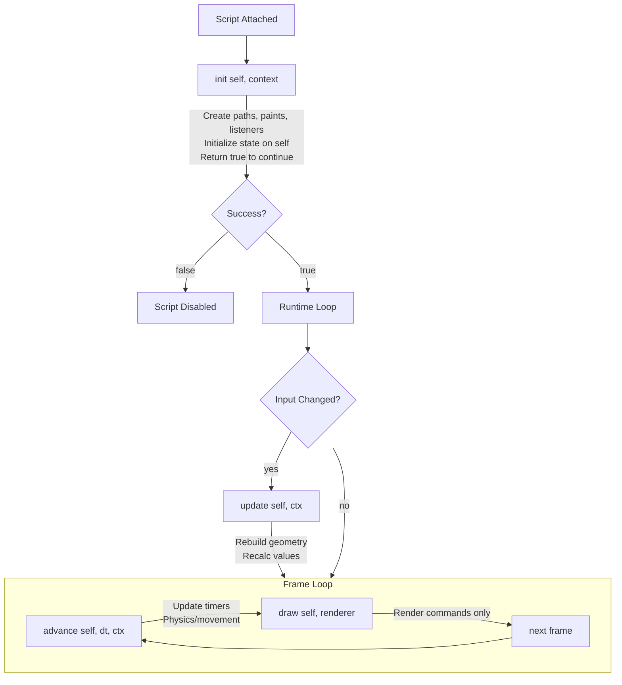

import Quiz from '@site/src/components/Quiz';
import ExerciseValidator from '@site/src/components/ExerciseValidator';
import Term from '@site/src/components/Term';

# Protocols Overview

## Learning Objectives
- Understand when each lifecycle callback runs
- Know where to put different types of logic
- Optimize performance by using the right callback
- Handle pointer events for user interaction

---

## AE/JS Syntax Comparison

| Concept | After Effects / JavaScript | Luau (Rive Scripts) |
|---------|---------------------------|---------------------|
| Initialization | Class `constructor()` | `init(self)` |
| Property change handler | React's `componentDidUpdate` | `update(self)` |
| Frame loop | `requestAnimationFrame(callback)` | `advance(self, seconds)` |
| Render function | Canvas `draw()` or React's `render()` | `draw(self, renderer)` |
| Delta time | `performance.now()` difference | `seconds` parameter in `advance` |
| Click handler | `element.onclick = fn` | `pointerDown(self, position)` |
| This reference | `this` keyword | `self` parameter |

:::danger Critical Difference: Frame Loop Architecture
**After Effects**: Expressions are evaluated when the playhead moves. You don't control the frame loop—AE handles it and just asks "what value at this time?"

**JavaScript (Canvas/WebGL)**: You call `requestAnimationFrame()` and manage your own frame loop. The browser tells you "it's time to draw" and you do everything.

**Rive Scripts**: Rive manages the frame loop automatically. You implement callbacks (`init`, `update`, `advance`, `draw`) and Rive calls them at the right time. You DON'T call `requestAnimationFrame`—Rive does that for you.

```lua
-- Rive handles the loop, you just implement callbacks:
function advance(self: MyNode, seconds: number): boolean
    -- Called every frame automatically
    self.time += seconds
    return true
end
```

```javascript
// JavaScript - you manage the loop yourself:
function loop(timestamp) {
    const deltaTime = timestamp - lastTime;
    lastTime = timestamp;
    advance(deltaTime / 1000);
    draw();
    requestAnimationFrame(loop);  // You call this!
}
requestAnimationFrame(loop);
```
:::

---

## Rive Context: When Your Code Runs

Rive calls your script functions in a specific order. Understanding this lets you put logic in the right place and avoid unnecessary work every frame.

**Lifecycle order:**
1. `init(self, context)` - runs once at startup
2. `update(self, context)` - runs when any <Term>Input</Term> changes
3. `advance(self, seconds, context)` - runs every frame (logic)
4. `draw(self, renderer)` - runs every frame after `advance` (rendering)

Pointer event handlers (`pointerDown`, `pointerMove`, etc.) run when the user interacts with the script node.

---

## What Goes Where

| Callback | Purpose | Frequency | AE/JS Equivalent |
|----------|---------|-----------|------------------|
| **init** | Create paths, paints, listeners, long-lived objects | Once | `constructor()` |
| **update** | Respond to input changes; rebuild paths or cached values | On input change | `componentDidUpdate()` |
| **advance** | Update time-based state (movement, physics, timers) | Every frame | `requestAnimationFrame` logic |
| **draw** | Issue <Term>Renderer</Term> commands only | Every frame | Canvas `ctx.draw()` calls |

:::tip Performance Rule
Put expensive work in `update` or `init`, not in `draw` or `advance`. Rebuilding geometry every frame wastes resources if inputs haven't changed.
:::

---

## The Context Object

The `context` parameter passed to lifecycle functions provides access to the runtime environment. Store it in `init` to use later.

### Context API

| Method | Returns | Description |
|--------|---------|-------------|
| `context:viewModel()` | `ViewModel?` | Gets the <Term>Artboard</Term>'s <Term>ViewModel</Term> (if bound) |
| `context:markNeedsUpdate()` | *void* | Requests a redraw on the next frame |

### Common Usage

```lua
export type MyNode = {
    context: Context,  -- Store context for later use
}

function init(self: MyNode, context: Context): boolean
    self.context = context  -- Save for use in listeners

    -- Access ViewModel through context
    local vm = context:viewModel()
    if vm then
        local prop = vm:getNumber("score")
        if prop then
            prop:addListener(function()
                -- Request redraw when data changes
                self.context:markNeedsUpdate()
            end)
        end
    end

    return true
end
```

:::info When to Use context:markNeedsUpdate()
Call `markNeedsUpdate()` when external changes (like ViewModel property updates) need to trigger a redraw. This is more efficient than constantly redrawing - it tells Rive "something changed, please redraw next frame."
:::

---

## Lifecycle Flow Diagram



---

## Practice Exercises

### Exercise 1: Lifecycle Probe ⭐ {#exercise-1-lifecycle-probe}

### Premise

Understanding when each callback runs is crucial: init once at start, update when inputs change, advance every frame. This helps you put code in the right place.

:::info Goal
By the end of this exercise, you will be able to Complete the lifecycle probe that logs when each callback runs and counts advance calls for 2 seconds.
:::

### Use Case

This pattern shows up whenever you build behavior in Rive scripts.

**Example scenarios:**
- Debugging script behavior
- Driving animation logic

---

### Setup

#### In Rive Editor:

1. **Create the script:**
   - Assets panel → `+` → Script → Node Script
   - Name it `Exercise1_Exercise1LifecycleProbe`

2. **Attach and run:**
   - Attach to any shape and press Play

3. **Open the Console:**
   - View → Console

---

### Starter Code

```lua
--!strict
-- A probe to see when each lifecycle callback runs

export type LifecycleProbe = {
    elapsed: number,
    advanceCount: number,
}

function init(self: LifecycleProbe): boolean
    -- TODO 1: Print "init: Starting probe"

    self.elapsed = 0
    self.advanceCount = 0
    return true
end

function advance(self: LifecycleProbe, seconds: number): boolean
    self.elapsed += seconds

    -- TODO 2: Increment advanceCount

    -- TODO 3: Every second (when floor(elapsed) changes), print "advance tick {count}"

    -- TODO 4: When elapsed >= 2, print "ANSWER: probe" (only once)

    return true
end

function draw(self: LifecycleProbe, renderer: Renderer)
end

return function(): Node<LifecycleProbe>
    return {
        init = init,
        advance = advance,
        draw = draw,
        elapsed = 0,
        advanceCount = 0,
    }
end
```

---

### Assignment

Complete these tasks:

1. Complete the lifecycle probe that logs when each callback runs and counts advance calls for 2 seconds.
2. Run the script and verify the console output
3. Copy the `ANSWER:` line into the validator

---

### Expected Output

```
Console prints the relevant debug lines for this exercise.
ANSWER: <your result>
```

---

### Verify Your Answer

<ExerciseValidator
    exerciseId="rive-lifecycle-1"
    expectedAnswer="ANSWER: probe"
/>

---

### Checklist

- [ ] `--!strict` is at the top
- [ ] All TODOs are replaced with working code
- [ ] Console output includes the `ANSWER:` line

---

---

### Exercise 2: Rebuild Only on Updates ⭐⭐ {#exercise-2-rebuild-only-on-updates}

### Premise

Put expensive work in update, not draw. The update callback only runs when inputs change, saving CPU cycles compared to rebuilding every frame.

:::info Goal
By the end of this exercise, you will be able to Complete the rebuild function and verify it only runs when needed (in init and update, NOT every frame in draw).
:::

### Use Case

This pattern shows up whenever you build behavior in Rive scripts.

**Example scenarios:**
- Debugging script behavior
- Driving animation logic

---

### Setup

#### In Rive Editor:

1. **Create the script:**
   - Assets panel → `+` → Script → Node Script
   - Name it `Exercise2_Exercise2RebuildOnlyOnUpdates`

2. **Attach and run:**
   - Attach to any shape and press Play

3. **Open the Console:**
   - View → Console

---

### Starter Code

```lua
--!strict
-- Rebuild geometry only when inputs change

export type OnDemandShape = {
    width: Input<number>,
    height: Input<number>,
    rebuildCount: number,
    path: Path,
    paint: Paint,
}

local function rebuild(self: OnDemandShape)
    -- TODO 1: Increment rebuildCount

    -- TODO 2: Calculate halfW and halfH from width/height

    -- TODO 3: Build rectangle path using reset, moveTo, lineTo, close

    -- Print rebuild info
    print(\`Rebuild #{self.rebuildCount}: {self.width} x {self.height}\`)

    -- TODO 4: When rebuildCount reaches 2, print "ANSWER: efficient"
end

function init(self: OnDemandShape): boolean
    print("init: Creating shape")
    self.rebuildCount = 0
    self.path = Path.new()
    self.paint = Paint.with({ style = "fill", color = Color.rgb(120, 220, 140) })
    rebuild(self)
    return true
end

function update(self: OnDemandShape)
    rebuild(self)
end

function draw(self: OnDemandShape, renderer: Renderer)
    -- Note: NO rebuild here - that would waste resources!
    renderer:drawPath(self.path, self.paint)
end

return function(): Node<OnDemandShape>
    return {
        init = init,
        update = update,
        draw = draw,
        width = 120,
        height = 80,
        rebuildCount = 0,
        path = late(),
        paint = late(),
    }
end
```

---

### Assignment

Complete these tasks:

1. Complete the rebuild function and verify it only runs when needed (in init and update, NOT every frame in draw).
2. Run the script and verify the console output
3. Copy the `ANSWER:` line into the validator

---

### Expected Output

```
Console prints the relevant debug lines for this exercise.
ANSWER: <your result>
```

---

### Verify Your Answer

<ExerciseValidator
    exerciseId="rive-lifecycle-2"
    expectedAnswer="ANSWER: efficient"
/>

---

### Checklist

- [ ] `--!strict` is at the top
- [ ] All TODOs are replaced with working code
- [ ] Console output includes the `ANSWER:` line

---

---

### Exercise 3: Combining Lifecycle Callbacks ⭐⭐ {#exercise-3-combining-lifecycle-callbacks}

### Premise

Combining update (for input changes) and advance (for animation) lets you build components that are both configurable AND animated. This is the foundation for interactive game elements.

:::info Goal
By the end of this exercise, you will be able to Complete the advance function to create a pulsing animation. After 2 seconds of animation, print the answer.
:::

### Use Case

This pattern shows up whenever you build behavior in Rive scripts.

**Example scenarios:**
- Debugging script behavior
- Driving animation logic

---

### Setup

#### In Rive Editor:

1. **Create the script:**
   - Assets panel → `+` → Script → Node Script
   - Name it `Exercise3_Exercise3CombiningLifecycleCallbacks`

2. **Attach and run:**
   - Attach to any shape and press Play

3. **Open the Console:**
   - View → Console

---

### Starter Code

```lua
--!strict
-- A shape that pulses over time

export type AnimatedShape = {
    baseSize: number,
    pulseSpeed: number,
    time: number,
    path: Path,
    paint: Paint,
}

local function rebuildPath(self: AnimatedShape, size: number)
    local half = size / 2
    self.path:reset()
    self.path:moveTo(Vector.xy(-half, -half))
    self.path:lineTo(Vector.xy(half, -half))
    self.path:lineTo(Vector.xy(half, half))
    self.path:lineTo(Vector.xy(-half, half))
    self.path:close()
end

function init(self: AnimatedShape): boolean
    print("init: Creating animated shape")
    self.time = 0
    self.path = Path.new()
    self.paint = Paint.with({ style = "fill", color = Color.rgb(255, 120, 80) })
    rebuildPath(self, self.baseSize)
    return true
end

function advance(self: AnimatedShape, seconds: number): boolean
    -- TODO 1: Add seconds to self.time

    -- TODO 2: Calculate pulse using: math.sin(self.time * self.pulseSpeed) * 0.2 + 1
    -- This creates a value between 0.8 and 1.2
    local pulse = 1

    -- TODO 3: Calculate currentSize as baseSize * pulse
    local currentSize = self.baseSize

    -- TODO 4: Rebuild the path with currentSize

    -- Log pulse every second
    if math.floor(self.time) > math.floor(self.time - seconds) and self.time > 0 then
        print(\`advance: pulse = {string.format("%.2f", pulse)}\`)
    end

    -- TODO 5: After 2 seconds, print "ANSWER: pulsing"

    return true
end

function draw(self: AnimatedShape, renderer: Renderer)
    renderer:drawPath(self.path, self.paint)
end

return function(): Node<AnimatedShape>
    return {
        init = init,
        advance = advance,
        draw = draw,
        baseSize = 60,
        pulseSpeed = 2,
        time = 0,
        path = late(),
        paint = late(),
    }
end
```

---

### Assignment

Complete these tasks:

1. Complete the advance function to create a pulsing animation. After 2 seconds of animation, print the answer.
2. Run the script and verify the console output
3. Copy the `ANSWER:` line into the validator

---

### Expected Output

```
Console prints the relevant debug lines for this exercise.
ANSWER: <your result>
```

---

### Verify Your Answer

<ExerciseValidator
    exerciseId="rive-lifecycle-3"
    expectedAnswer="ANSWER: pulsing"
/>

---

### Checklist

- [ ] `--!strict` is at the top
- [ ] All TODOs are replaced with working code
- [ ] Console output includes the `ANSWER:` line

---

---

## Pointer Events

Node scripts can also respond to pointer interactions. These are like DOM event handlers in JavaScript.

```lua
function pointerDown(self: MyNode, position: Vector): boolean
    print(`Clicked at {position.x}, {position.y}`)
    return true  -- Return true to consume the event
end

function pointerMove(self: MyNode, position: Vector): boolean
    return false  -- Return false to let the event propagate
end

function pointerUp(self: MyNode, position: Vector): boolean
    return true
end
```

```javascript
// JavaScript equivalent - DOM event handlers:
element.addEventListener('mousedown', (e) => {
    console.log(`Clicked at ${e.clientX}, ${e.clientY}`);
    e.stopPropagation();  // Like returning true
});

element.addEventListener('mousemove', (e) => {
    // Not calling stopPropagation = like returning false
});
```

Include these in your factory return table to enable them:

```lua
return function(): Node<MyNode>
    return {
        init = init,
        draw = draw,
        pointerDown = pointerDown,
        pointerMove = pointerMove,
        pointerUp = pointerUp,
    }
end
```

---

### Exercise 4: Click Counter ⭐⭐ {#exercise-4-click-counter}

### Premise

Pointer events (pointerDown, pointerMove, pointerUp) enable interactivity. Return true to consume an event, false to let it propagate. This is the foundation of buttons, toggles, and draggable elements.

:::info Goal
By the end of this exercise, you will be able to Complete the click counter that tracks clicks and animates a pop effect. Print the answer after 3 clicks.
:::

### Use Case

This pattern shows up whenever you build behavior in Rive scripts.

**Example scenarios:**
- Debugging script behavior
- Driving animation logic

---

### Setup

#### In Rive Editor:

1. **Create the script:**
   - Assets panel → `+` → Script → Node Script
   - Name it `Exercise4_Exercise4ClickCounter`

2. **Attach and run:**
   - Attach to any shape and press Play

3. **Open the Console:**
   - View → Console

---

### Starter Code

```lua
--!strict
-- A clickable shape that counts clicks

export type ClickCounter = {
    clickCount: number,
    displayScale: number,
    path: Path,
    paint: Paint,
}

function init(self: ClickCounter): boolean
    self.clickCount = 0
    self.displayScale = 1

    self.path = Path.new()
    self.path:moveTo(Vector.xy(-60, -30))
    self.path:lineTo(Vector.xy(60, -30))
    self.path:lineTo(Vector.xy(60, 30))
    self.path:lineTo(Vector.xy(-60, 30))
    self.path:close()

    self.paint = Paint.with({ style = "fill", color = Color.rgb(80, 160, 255) })
    return true
end

function pointerDown(self: ClickCounter, position: Vector): boolean
    -- TODO 1: Increment clickCount

    -- TODO 2: Set displayScale to 1.2 for pop effect

    -- TODO 3: Print "Click #{clickCount}"

    -- TODO 4: When clickCount reaches 3, print "ANSWER: interactive"

    -- TODO 5: Return true to consume the event
    return false
end

function advance(self: ClickCounter, seconds: number): boolean
    -- TODO 6: Animate displayScale back to 1
    -- Use: self.displayScale = math.max(1, self.displayScale - seconds * 2)

    return true
end

function draw(self: ClickCounter, renderer: Renderer)
    renderer:save()
    renderer:transform(Mat2D.withScale(self.displayScale, self.displayScale))
    renderer:drawPath(self.path, self.paint)
    renderer:restore()
end

return function(): Node<ClickCounter>
    return {
        init = init,
        pointerDown = pointerDown,
        advance = advance,
        draw = draw,
        clickCount = 0,
        displayScale = 1,
        path = late(),
        paint = late(),
    }
end
```

---

### Assignment

Complete these tasks:

1. Complete the click counter that tracks clicks and animates a pop effect. Print the answer after 3 clicks.
2. Run the script and verify the console output
3. Copy the `ANSWER:` line into the validator

---

### Expected Output

```
Console prints the relevant debug lines for this exercise.
ANSWER: <your result>
```

---

### Verify Your Answer

<ExerciseValidator
    exerciseId="rive-lifecycle-4"
    expectedAnswer="ANSWER: interactive"
/>

---

### Checklist

- [ ] `--!strict` is at the top
- [ ] All TODOs are replaced with working code
- [ ] Console output includes the `ANSWER:` line

---

---

## Knowledge Check

<Quiz
  question="In what order do the main lifecycle callbacks run?"
  id="lifecycle-q1"
  options={[
    { text: "draw, init, advance, update" },
    { text: "init, update, advance, draw", correct: true },
    { text: "init, advance, update, draw" },
    { text: "update, init, draw, advance" },
  ]}
  explanation="The lifecycle runs: init (once), then update (on input change), advance (every frame), and draw (every frame after advance)."
/>

<Quiz
  question="When should you rebuild geometry in a Node script?"
  id="lifecycle-q2"
  options={[
    { text: "In draw, every frame" },
    { text: "In advance, every frame" },
    { text: "In update, when inputs change", correct: true },
    { text: "Never, geometry is immutable" },
  ]}
  explanation="Rebuild geometry in update when inputs change to avoid unnecessary work every frame. Only rebuild in advance if the geometry is animated."
/>

<Quiz
  question="What is the purpose of the draw function?"
  id="lifecycle-q3"
  options={[
    { text: "Create <Term>Path</Term> and <Term>Paint</Term> objects" },
    { text: "Update game logic and physics" },
    { text: "Issue renderer commands only", correct: true },
    { text: "Handle user input" },
  ]}
  explanation="draw should only issue renderer commands (drawPath, drawImage, etc.). All logic and object creation should happen in other callbacks."
/>

<Quiz
  question="What does returning false from a pointer event handler do?"
  id="lifecycle-q4"
  options={[
    { text: "Disables future pointer events" },
    { text: "Lets the event propagate to other handlers", correct: true },
    { text: "Cancels the current animation" },
    { text: "Throws an error" },
  ]}
  explanation="Returning false from a pointer event handler allows the event to propagate to other nodes. Returning true consumes the event."
/>

---

## Common Mistakes

### 1. Creating Objects in draw()

```lua
-- WRONG: Creating objects every frame wastes resources
function draw(self: MyNode, renderer: Renderer)
    local path = Path.new()  -- DON'T do this!
    addCircle(path, Vector.xy(0, 0), 50)  -- Rebuilding every frame!
    renderer:drawPath(path, self.paint)
end

-- CORRECT: Create in init, draw only issues commands
function init(self: MyNode): boolean
    self.path = Path.new()
    addCircle(self.path, Vector.xy(0, 0), 50)
    return true
end

function draw(self: MyNode, renderer: Renderer)
    renderer:drawPath(self.path, self.paint)
end

-- Helper: Draw circle using cubic bezier approximation
local function addCircle(path: Path, center: Vector, radius: number)
    local k = 0.5522847498  -- Bezier circle constant
    local cx, cy, r = center.x, center.y, radius
    path:moveTo(Vector.xy(cx, cy - r))
    path:cubicTo(Vector.xy(cx + r*k, cy - r), Vector.xy(cx + r, cy - r*k), Vector.xy(cx + r, cy))
    path:cubicTo(Vector.xy(cx + r, cy + r*k), Vector.xy(cx + r*k, cy + r), Vector.xy(cx, cy + r))
    path:cubicTo(Vector.xy(cx - r*k, cy + r), Vector.xy(cx - r, cy + r*k), Vector.xy(cx - r, cy))
    path:cubicTo(Vector.xy(cx - r, cy - r*k), Vector.xy(cx - r*k, cy - r), Vector.xy(cx, cy - r))
    path:close()
end
```

### 2. Rebuilding Geometry in advance() When Not Animated

```lua
-- WRONG: Rebuilding every frame when size is static
function advance(self: MyNode, seconds: number): boolean
    rebuildPath(self, self.size)  -- Wasteful!
    return true
end

-- CORRECT: Rebuild only when size input changes
function update(self: MyNode)
    rebuildPath(self, self.size)
end
```

### 3. Forgetting to Return from Pointer Handlers

```lua
-- WRONG: Missing return value
function pointerDown(self: MyNode, position: Vector)
    print("Clicked!")
    -- No return - behavior undefined
end

-- CORRECT: Always return a boolean
function pointerDown(self: MyNode, position: Vector): boolean
    print("Clicked!")
    return true  -- Consume the event
end
```

---

## Rive Takeaway

Put expensive work in `update`, not in `draw` or `advance`. Understanding the lifecycle helps you write efficient scripts that only do work when necessary.

---

## Next Steps

- Continue to [Layout Script Protocol](/rive/protocols/layout-protocol)
- Need a refresher? Review [Quick Reference](/quick-reference)
