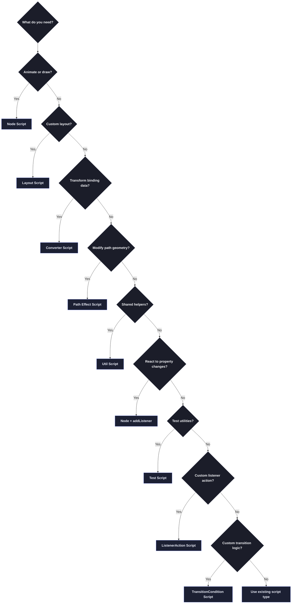

import Term from '@site/src/components/Term';

# Script Types Overview

Rive provides **8 script types**, each designed for a specific purpose. This page gives you the big picture — which script type to choose and when.

:::info Runtime baseline
This overview is aligned to the June 4, 2026 compatibility baseline: public npm runtime line `2.37.8` plus source-level API snapshot `runtime-v0.1.106`. GPU callback guidance remains Rive Early Access editor workflow material. For versioned API-surface tracking, see [Runtime Compatibility Baseline](/rive/runtime-compatibility).
:::

:::info Need Full Access/Limitations Matrix?
For a comprehensive "what can each script type do?" reference (including callback parameters, path-geometry boundaries, and input accessibility), see [Script Capability Matrix](/rive/script-capability-matrix).
:::

:::tip Coming from Part 1?
If you haven't read [How Rive Scripts Work](/getting-started/how-rive-scripts-work) yet, start there first. It explains WHY scripts have the structure they do — the "protocol" concept, factory functions, and lifecycle callbacks.
:::

---

## The 8 Script Types

| Script Type | Primary Purpose | Placement / Binding Target |
|-------------|-----------------|-----------|
| **[<Term>Node</Term> Script](#node-script)** | Animation logic, custom rendering | Scene script node |
| **[Layout Script](#layout-script)** | Custom layout behavior | Layout components |
| **[Converter Script](#converter-script)** | Data transformation for bindings | Data bindings |
| **[<Term>Path</Term> Effect Script](#path-effect-script)** | Modify path geometry | Strokes & Fills |
| **[ListenerAction Script](#listeneraction-script)** | Custom logic on state machine listener events | State machine listeners |
| **[TransitionCondition Script](#transitioncondition-script)** | Custom transition evaluation logic | State machine transitions |
| **[Util Script](#util-script)** | Shared code libraries | Nothing (imported) |
| **[Test Script](#test-script)** | Unit testing Util Scripts | Nothing (run manually) |

:::info Listeners
`Listener<T>` is a **function signature**, not a script type. See [Listeners](./protocols/listener-protocol) for details.
:::

---

## Node Script

**Use when:** You need animation logic, custom drawing, or interactive behavior on a node.

**Key features:**
- Lifecycle callbacks: `init`, `update`, `advance`, `drawCanvas`, `draw`
- Pointer event handlers: `pointerDown`, `pointerMove`, `pointerUp`
- Text/keyboard handlers: `textEvent`, `keyboardEvent`
- Access to <Term>Renderer</Term> for custom drawing
- Access to `Canvas` / `GPUCanvas` render phases for offscreen and shader workflows
- Can have inputs from the editor

**Placement:** A Node script is added to the artboard as a script node. You can leave it at the artboard root or nest it under a group/shape for normal hierarchy behavior such as transform inheritance and draw order. Nesting does not pass the parent shape's `NodeData` or `PathData` into the Node callbacks.

**Typical use cases:**
- Procedural animations (particles, physics)
- Custom drawing (graphs, visualizations)
- GPU shader passes and post-processing
- Interactive elements (buttons, sliders)
- Game logic (collision, scoring)

**Factory return type:** `Node<T>`

```lua
return function(): Node<MyScript>
    return { init = init, advance = advance, draw = draw }
end
```

**Learn more:** [Node Script Protocol →](./protocols/node-protocol) | [Node Lifecycle →](./protocols/node-lifecycle)

---

## Layout Script

**Use when:** You need programmatic control over how child elements are positioned and sized within a Layout component.

**Key features:**
- All Node Script lifecycle callbacks PLUS:
- `measure()` - Propose ideal size (for "Hug" fit type)
- `resize(size)` - React to size changes, position children

**Typical use cases:**
- Masonry grids
- Carousels with custom spacing
- Responsive layouts with breakpoint logic
- Data-driven layout systems

**Factory return type:** `Layout<T>`

```lua
return function(): Layout<MyLayout>
    return { init = init, measure = measure, resize = resize, draw = draw }
end
```

**Learn more:** [Layout Script Protocol →](./protocols/layout-protocol)

---

## Converter Script

**Use when:** You need to transform data between a source and target in data bindings.

**Key features:**
- `convert(input)` - Transform source → target
- `reverseConvert(input)` - Transform target → source (for two-way binding)
- Works with DataValue types (Number, String, Boolean, Color)

**Typical use cases:**
- Format numbers (add units, decimals)
- Temperature conversion (Celsius ↔ Fahrenheit)
- Color transformations
- String formatting/parsing

**Factory return type:** `Converter<T, InputType, OutputType>`

```lua
return function(): Converter<MyConverter, DataValueNumber, DataValueString>
    return { convert = convert, reverseConvert = reverseConvert }
end
```

**Learn more:** [Converter Script Protocol →](./protocols/converter-protocol)

---

## Path Effect Script

**Use when:** You need to modify the geometry of a path in real-time (stroke effects, fill distortions, warps).

**Key features:**
- `update(inPath, node)` - Receives original PathData and host NodeReadData, returns modified PathData
- `advance(seconds)` - Optional frame updates for animated effects
- Access to PathCommand iteration

**Typical use cases:**
- Wave/wobble distortion effects
- Custom dash patterns
- Procedural path generation
- Animated stroke and fill effects

**Factory return type:** `PathEffect<T>`

```lua
return function(): PathEffect<MyEffect>
    return { init = init, update = update, advance = advance }
end
```

**Learn more:** [Path Effect Script Protocol →](./protocols/path-effect-protocol)

---

## ListenerAction Script

**Use when:** You need custom logic to run when a state machine listener event fires.

**Key features:**
- `init(self, context)` - One-time initialization
- `performAction(self, listenerContext)` - Executed when the listener action triggers (preferred)
- `perform(self, pointerEvent)` - Legacy/deprecated callback in older scaffolds
- `listenerContext` supports typed branching (`is...` / `as...`) for pointer, keyboard, text, focus, and listener payload kinds
- Attached to state machine listener events

**Typical use cases:**
- Custom side-effects when a state transition fires a listener
- Triggering audio, analytics, or other actions from state machine events
- Complex logic that can't be expressed with simple state machine outputs

**Factory return type:** `ListenerAction<T>`

```lua
return function(): ListenerAction<MyAction>
    return { init = init, performAction = performAction }
end
```

**Learn more:** [ListenerAction Script Protocol →](./protocols/listener-action-protocol)

---

## TransitionCondition Script

**Use when:** You need custom logic to evaluate whether a state machine transition should fire.

**Key features:**
- `init(self, context)` - One-time initialization
- `evaluate(self)` - Returns true/false to allow/block the transition
- Attached to state machine transitions

**Typical use cases:**
- Complex transition conditions that depend on multiple inputs
- Time-based or physics-based transition logic
- Conditions that require script-level computation

**Factory return type:** `TransitionCondition<T>`

```lua
return function(): TransitionCondition<MyCondition>
    return { init = init, evaluate = evaluate }
end
```

**Learn more:** [TransitionCondition Script Protocol →](./protocols/transition-condition-protocol)

---

## ScriptedInterpolator (Runtime-Backed Advanced Protocol)

**Use when:** You need custom interpolation curves at runtime for keyframe value blending and want script-controlled easing behavior.

**Current status:**
- Runtime support is present in the audited C++ bindings tracked by the current compatibility baseline.
- This protocol is documented in LERP for compatibility tracking and advanced usage.
- Editor UI exposure can lag runtime support; verify availability in your current editor build before production use.

**Key methods:**
- `transform(self, factor) -> number` (optional)
- `transformValue(self, valueFrom, valueTo, factor) -> number` (optional)

**Fallback behavior:**
- If methods are omitted or fail, runtime falls back to standard linear interpolation behavior.

**Learn more:** [ScriptedInterpolator Protocol →](./protocols/scripted-interpolator-protocol)

---

## Util Script

**Use when:** You have shared code (math functions, constants, helpers) used by multiple scripts.

:::tip Creating a Util Script
In the Rive editor, select **Blank Script** from the script type dropdown. There is no dedicated "Util Script" option—you create one by selecting Blank Script and following the Util Script pattern described below and in the [official Rive docs](https://rive.app/docs/scripting/protocols/util-scripts).
:::

**Key features:**
- No lifecycle callbacks — just a module table
- Imported with `require("UtilName")`
- Runs once when first required (cached)
- Perfect for pure functions and constants

**Typical use cases:**
- Math utilities (lerp, clamp, easing functions)
- Color palettes and constants
- Helper functions shared across scripts
- Configuration objects

**Return type:** Module table (not a factory)

```lua
local MathUtils = {}

function MathUtils.lerp(a: number, b: number, t: number): number
    return a + (b - a) * t
end

return MathUtils
```

**Learn more:** [Util Script Protocol →](./protocols/util-protocol)

---

## Event Listening (Not a Script Type)

:::warning `Listener<T>` is NOT a Script Type
`Listener<T>` is a **function signature** for `addListener()`/`removeListener()` methods, not a script return type.
:::

**To handle events in Rive, use these patterns:**

**1. ViewModel Property Listeners (in Node scripts):**
```lua
function init(self: MyNode, context: Context): boolean
    local vm = context:viewModel()
    local score = vm:getNumber("score")
    if score then
        score:addListener(function()
            print("Score changed to: " .. score.value)
        end)
    end
    return true
end
```

**2. Pointer Events (in Node scripts):**
```lua
function pointerDown(self: MyNode, event: PointerEvent)
    print("Clicked at: " .. event.position.x)
end
```

**Learn more:** [Listeners →](./protocols/listener-protocol)

---

## Test Script

**Use when:** You want to write unit tests for your Util Scripts.

**Key features:**
- `setup(test: Tester)` - Define test cases
- `test.case(name, fn)` - Individual test
- `test.group(name, fn)` - Group related tests
- `expect(value).is(expected)` - Assertions

**Typical use cases:**
- Verify math utilities work correctly
- Test edge cases in helper functions
- Regression testing after changes
- Document expected behavior

**Return type:** `Tests` (function)

```lua
local MathUtils = require('MathUtils')

function setup(test: Tester)
    test.case('lerp at 0.5', function(expect)
        expect(MathUtils.lerp(0, 100, 0.5)).is(50)
    end)
end

return function(): Tests
    return setup
end
```

**Learn more:** [Test Script Protocol →](./protocols/test-protocol)

---

## Scripts and State Machines

Rive state machines decide **what state an animation is in**. Scripts decide **how that state is visualized or extended**.

**How they connect:**
- **ViewModels** are the primary data bridge. Use ViewModel properties to drive script behavior and UI state.
- **Script Inputs** (`Input<T>`) are best for per-instance tuning from the inspector.
- **State machine inputs** are a legacy path for data flow; use them only when integrating existing files.
- **Property listeners** (`addListener()`) respond to ViewModel property changes triggered by state machines.
- **Node scripts** render visuals and can **read** inputs or ViewModel values to drive drawing.

**Typical flow:**
1. State machine or interaction updates a ViewModel property (for example, `isHovering = true`)
2. Script reads that value in `update()` or via `addListener()`
3. Script changes visuals in `draw()` or updates ViewModel data

If you need to **react to property changes**, use `property:addListener()` in a Node script. If you need to **render or animate based on inputs**, use `update()` or `advance()` callbacks.

---

## Quick Decision Guide



---

## Factory Functions Recap

Remember from [Part 1](/getting-started/how-rive-scripts-work#4-return-function-nodemyscript--the-factory-function): every script (except Util and Test) uses a factory function. The factory creates fresh instances so each object using your script gets its own data.

| Script Type | Factory Return |
|-------------|----------------|
| Node | `Node<T>` |
| Layout | `Layout<T>` |
| Converter | `Converter<T, In, Out>` |
| Path Effect | `PathEffect<T>` |
| ListenerAction | `ListenerAction<T>` |
| TransitionCondition | `TransitionCondition<T>` |
| Util | Module table (no factory) |
| Test | `Tests` function (no factory) |

---

## Next Steps

- Continue to [Inputs and Data Binding](/rive/inputs)
- Need a refresher? Review [Quick Reference](/quick-reference)
