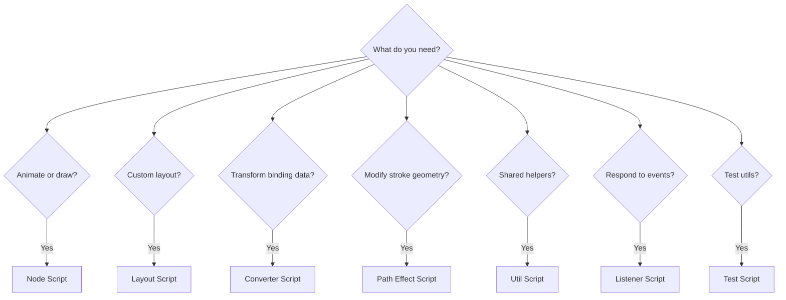

import Term from '@site/src/components/Term';

# Script Types Overview

Rive provides **7 script types**, each designed for a specific purpose. This page gives you the big picture — which script type to choose and when.

:::tip Coming from Part 1?
If you haven't read [How Rive Scripts Work](/getting-started/how-rive-scripts-work) yet, start there first. It explains WHY scripts have the structure they do — the "protocol" concept, factory functions, and lifecycle callbacks.
:::

---

## The 7 Script Types

| Script Type | Primary Purpose | Attach To |
|-------------|-----------------|-----------|
| **[<Term>Node</Term> Script](#node-script)** | Animation logic, custom rendering | Any node |
| **[Layout Script](#layout-script)** | Custom layout behavior | Layout components |
| **[Converter Script](#converter-script)** | Data transformation for bindings | Data bindings |
| **[<Term>Path</Term> Effect Script](#path-effect-script)** | Modify path geometry | Strokes |
| **[Util Script](#util-script)** | Shared code libraries | Nothing (imported) |
| **[Listener Script](#listener-script)** | Event handling | State machines, events |
| **[Test Script](#test-script)** | Unit testing Util Scripts | Nothing (run manually) |

---

## Node Script

**Use when:** You need animation logic, custom drawing, or interactive behavior on a node.

**Key features:**
- Lifecycle callbacks: `init`, `update`, `advance`, `draw`
- Pointer event handlers: `pointerDown`, `pointerMove`, `pointerUp`
- Access to <Term>Renderer</Term> for custom drawing
- Can have inputs from the editor

**Typical use cases:**
- Procedural animations (particles, physics)
- Custom drawing (graphs, visualizations)
- Interactive elements (buttons, sliders)
- Game logic (collision, scoring)

**Factory return type:** `Node<T>`

```lua
return function(): Node<MyScript>
    return { init = init, advance = advance, draw = draw }
end
```

**Learn more:** [Node Script Protocol →](./protocols/node-protocol) | [Node Lifecycle →](./protocols/node-lifecycle)

---

## Layout Script

**Use when:** You need programmatic control over how child elements are positioned and sized within a Layout component.

**Key features:**
- All Node Script lifecycle callbacks PLUS:
- `measure()` - Propose ideal size (for "Hug" fit type)
- `resize(size)` - React to size changes, position children

**Typical use cases:**
- Masonry grids
- Carousels with custom spacing
- Responsive layouts with breakpoint logic
- Data-driven layout systems

**Factory return type:** `Layout<T>`

```lua
return function(): Layout<MyLayout>
    return { init = init, measure = measure, resize = resize, draw = draw }
end
```

**Learn more:** [Layout Script Protocol →](./protocols/layout-protocol)

---

## Converter Script

**Use when:** You need to transform data between a source and target in data bindings.

**Key features:**
- `convert(input)` - Transform source → target
- `reverseConvert(input)` - Transform target → source (for two-way binding)
- Works with DataValue types (Number, String, Boolean, Color)

**Typical use cases:**
- Format numbers (add units, decimals)
- Temperature conversion (Celsius ↔ Fahrenheit)
- Color transformations
- String formatting/parsing

**Factory return type:** `Converter<T, InputType, OutputType>`

```lua
return function(): Converter<MyConverter, DataValueNumber, DataValueString>
    return { convert = convert, reverseConvert = reverseConvert }
end
```

**Learn more:** [Converter Script Protocol →](./protocols/converter-protocol)

---

## Path Effect Script

**Use when:** You need to modify the geometry of a path in real-time (stroke effects, distortions).

**Key features:**
- `update(inPath)` - Receives original PathData, returns modified PathData
- `advance(seconds)` - Optional frame updates for animated effects
- Access to PathCommand iteration

**Typical use cases:**
- Wave/wobble distortion effects
- Custom dash patterns
- Procedural path generation
- Animated stroke effects

**Factory return type:** `PathEffect<T>`

```lua
return function(): PathEffect<MyEffect>
    return { init = init, update = update, advance = advance }
end
```

**Learn more:** [Path Effect Script Protocol →](./protocols/path-effect-protocol)

---

## Util Script

**Use when:** You have shared code (math functions, constants, helpers) used by multiple scripts.

**Key features:**
- No lifecycle callbacks — just a module table
- Imported with `require("UtilName")`
- Runs once when first required (cached)
- Perfect for pure functions and constants

**Typical use cases:**
- Math utilities (lerp, clamp, easing functions)
- Color palettes and constants
- Helper functions shared across scripts
- Configuration objects

**Return type:** Module table (not a factory)

```lua
local MathUtils = {}

function MathUtils.lerp(a: number, b: number, t: number): number
    return a + (b - a) * t
end

return MathUtils
```

**Learn more:** [Util Script Protocol →](./protocols/util-protocol)

---

## Listener Script

**Use when:** You need to handle events from state machines or custom event buses.

**Key features:**
- Event-driven (not frame-based)
- Responds to <Term>State Machine</Term> events
- Can handle pointer events on specific nodes
- Useful for decoupled event handling

**Typical use cases:**
- Respond to state machine transitions
- Handle clicks on multiple elements
- Event bus patterns
- Cross-component communication

**Factory return type:** `Listener<T>`

```lua
return function(): Listener<MyListener>
    return { init = init, onEvent = onEvent }
end
```

**Learn more:** [Listener Script Protocol →](./protocols/listener-protocol)

---

## Test Script

**Use when:** You want to write unit tests for your Util Scripts.

**Key features:**
- `setup(test: Tester)` - Define test cases
- `test.case(name, fn)` - Individual test
- `test.group(name, fn)` - Group related tests
- `expect(value).is(expected)` - Assertions

**Typical use cases:**
- Verify math utilities work correctly
- Test edge cases in helper functions
- Regression testing after changes
- Document expected behavior

**Return type:** `Tests` (function)

```lua
local MathUtils = require('MathUtils')

function setup(test: Tester)
    test.case('lerp at 0.5', function(expect)
        expect(MathUtils.lerp(0, 100, 0.5)).is(50)
    end)
end

return function(): Tests
    return setup
end
```

**Learn more:** [Test Script Protocol →](./protocols/test-protocol)

---

## Scripts and State Machines

Rive state machines decide **what state an animation is in**. Scripts decide **how that state is visualized or extended**.

**How they connect:**
- **Inputs** are the bridge. Bind state machine inputs to script inputs or <Term>ViewModel</Term> properties.
- **Listener scripts** respond to state machine events (transitions, triggers, custom events).
- **Node scripts** render visuals and can **read** inputs or ViewModel values to drive drawing.

**Typical flow:**
1. State machine updates an <Term>Input</Term> (e.g., `isHovering = true`)
2. Script reads that input in `update()` or `advance()`
3. Script changes visuals in `draw()` or updates ViewModel data

If you need to **react to transitions or events**, use a Listener script. If you need to **render or animate based on inputs**, use a Node script.

---

## Quick Decision Guide



---

## Factory Functions Recap

Remember from [Part 1](/getting-started/how-rive-scripts-work#5-return-function-nodemyscript--the-factory-function): every script (except Util and Test) uses a factory function. The factory creates fresh instances so each object using your script gets its own data.

| Script Type | Factory Return |
|-------------|----------------|
| Node | `Node<T>` |
| Layout | `Layout<T>` |
| Converter | `Converter<T, In, Out>` |
| Path Effect | `PathEffect<T>` |
| Listener | `Listener<T>` |
| Util | Module table (no factory) |
| Test | `Tests` function (no factory) |

---

## Next Steps

- Continue to [Inputs and Data Binding](/rive/inputs)
- Need a refresher? Review [Quick Reference](/quick-reference)
